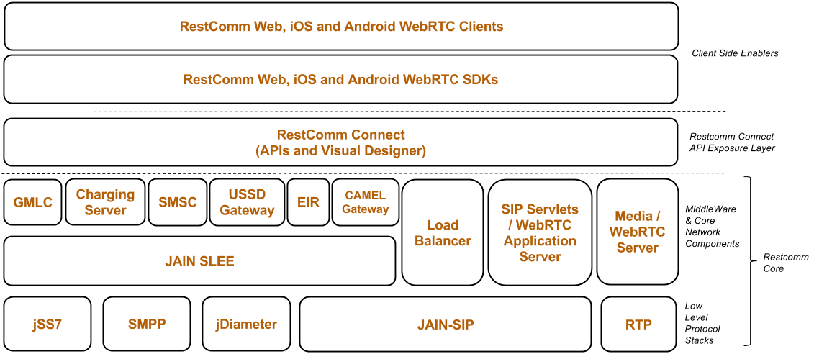

== RestComm Core Documentation

The Restcomm Communication Platform is the best architecture to integrate Communications as a Feature into your applications and services. It enables you create, deploy and manage services and applications integrating voice, video and data across a range of IP and legacy communications networks. It drives convergence with the following key enablers:

You will find documentation for each of the components below :

* link:http://documentation.telestax.com/connect/index.html[Restcomm-Connect]

* link:http://documentation.telestax.com/connect/sdks/index.html[Restcomm SDKs and Clients]

* link:http://documentation.telestax.com/core/sip_servlets/SIP_Servlets_Server_User_html[Restcomm SIP Servlets / SIP - IMS - LTE - WebRTC Application Server]

* link:http://documentation.telestax.com/core/jain_slee/JAIN_SLEE_User_Guide.html[Restcomm JAIN SLEE Service Delivery Platform]

* link:http://documentation.telestax.com/core/media_server/Media_Server_User_Guide.html[Restcomm Media Server]

* link:http://documentation.telestax.com/core/smsc/SMSC_Gateway_Installation_Guide.html[Restcomm SMSC Installation Guide]

* link:http://documentation.telestax.com/core/smsc/SMSC_Gateway_Amdin_Guide.html[Restcomm SMSC User Guide]

* link:http://documentation.telestax.com/core/ussd/USSD_Gateway_Installation_Guide.html[Restcomm USSD Gateway Installation Guide]

* link:http://documentation.telestax.com/core/ussd/USSD_Gateway_Admin_Guide.html[Restcomm USSD Gateway User Guide]

* link:http://documentation.telestax.com/core/gmlc/GMLC_Installation_Guide.html[Restcomm GMLC GeoLocation Server Installation Guide]

* link:http://documentation.telestax.com/core/gmlc/GMLC_Admin_Guide.html[Restcomm GMLC GeoLocation Server User Guide]

* link:http://documentation.telestax.com/core/ss7/SS7_Stack_Installation_Guide.html[Restcomm jSS7 Installation Guide]

* link:http://documentation.telestax.com/core/ss7/SS7_Stack_User_Guide.html[Restcomm jSS7 GeoLocation Server User Guide]

* link:http://documentation.telestax.com/core/diameter/Diameter_User_Guide.html[Restcomm jDiameter User Guide]

* link:http://documentation.telestax.com/core/lb/Load_Balancer_User_Guide.html[Restcomm Load Balancer User Guide]

You will find Tutorials at :

* link:http://documentation.telestax.com/connect/tutorials/index.html[Restcomm Tutorials]
