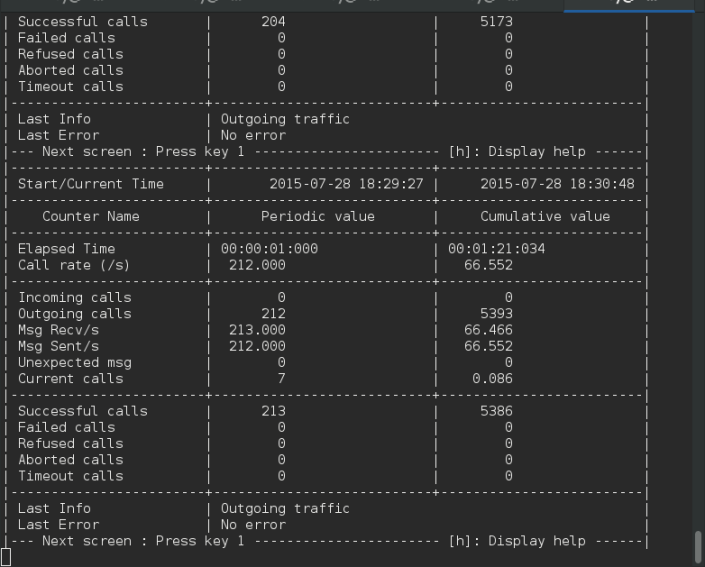

This tutorial will guide you through how to send traffic to Telscale jDiameter using Seagull. This test will measure maximum stack performance with no additional computing.  

[[requirements]]
= Requirements

* Ensure Java installed
* Install Seagull as explained link:http://gull.sourceforge.net/download/index.html[HERE] - The version used in this tutorial can be found here: http://downloads.sourceforge.net/project/gull/seagull/1.8.2/seagull-1.8.2-Linux_RHEL6U1_X86_64.tar.gz
* Ensure that *ksh* is installed
* Download the latest version of link:https://github.com/Restcomm/jdiameter[Restcomm jDiameter]

[[step-1---download-and-install-seagull]]
= Step 1 - Download and Install Seagull

* Download seagull as follows: *wget http://downloads.sourceforge.net/project/gull/seagull/1.8.2/seagull-1.8.2-Linux_RHEL6U1_X86_64.tar.gz*
* Extract the content of the  seagull file as follows : *tar -xvf seagull-1.8.2-Linux_RHEL6U1_X86_64.tar.gz*
* This will create a new directory  called packages, cd into the *packages* directory
* We are only interested in the rpm files seagull-core and seagull-diameter (You may install all if you so desire)
* Install the packages as shown below

[source,lang:default,decode:true]
----
sudo rpm -ivh seagull-core-1.8.2-linux-2.6-intel.rpm
Preparing...                          ################################# [100%]
Updating / installing...
  1:seagull-core-1.8.2-0             ################################# [100%]

Next install Diameter seagull app

sudo rpm -ivh seagull-diameter-protocol-1.8.2-linux-2.6-intel.rpm
Preparing...                          ################################# [100%]
Updating / installing...
  1:seagull-diameter-protocol-1.8.2-0################################# [100%]
----

*  Run the command : *seagull*
* You should see an output similar to the one below

[source,lang:default,decode:true]
----
seagull]$ seagull
option -conf is mandatory
seagull
 Version tool   : 1.8.2
 Command syntax : 
 -conf <configuration file name> 
 -scen <scenario file name> 
----

[[step-2---download-and-install-Restcomm-jDiameter]]
= Step 2  - Download and Install Restcomm jDiameter

* Run the command : git clone git@github.com:RestComm/jdiameter.git
* cd **jdiameter**/
* Run the command : *mvn clean install*
* Make sure the build is successfull as shown below:

[source,lang:default,decode:true]
----
[INFO] Restcomm :: Diameter :: diameter-parent ........... SUCCESS [  0.485 s]
[INFO] Restcomm :: Diameter Core :: diameter-core-parent . SUCCESS [  0.041 s]
[INFO] Restcomm :: Diameter Stack :: jdiameter-parent .... SUCCESS [  0.040 s]
[INFO] Restcomm :: Diameter Stack :: jdiameter-api ....... SUCCESS [  2.805 s]
[INFO] Restcomm :: Diameter Stack :: jdiameter-impl ...... SUCCESS [  6.583 s]
[INFO] Restcomm :: Diameter Stack HA :: jdiameter-ha-parent SUCCESS [  0.011 s]
[INFO] Restcomm :: Diameter Stack HA :: jdiameter-ha-api . SUCCESS [  0.721 s]
[INFO] Restcomm :: Diameter Stack HA :: jdiameter-ha-impl  SUCCESS [  1.307 s]
----

* go to the directory **jdiameter/examples**/
* Download from the link : wget https://app.box.com/shared/static/zasdgurv1gbsi0jm46kqbwr06gincfas.zip
* *unzip zasdgurv1gbsi0jm46kqbwr06gincfas.zip*
* This will create 2 new directories inside the *jdiameter/examples/* directory: 
** charging-server-simulator-perf-config  
** charging-server-simulator-perf-test
* Go to the directory *jdiameter/examples/charging-server-simulator-perf-test/*
* Run the command: *mvn clean install -Prelease*
* If the build is successfull, you should see the following output:

[source,lang:default,decode:true]
----
[INFO] META-INF/maven/ already added, skipping
[INFO] META-INF/maven/org.mobicents.diameter/ already added, skipping
[INFO] ------------------------------------------------------------------------
[INFO] BUILD SUCCESS
[INFO] ------------------------------------------------------------------------
[INFO] Total time: 9.163 s
[INFO] Finished at: 2015-07-28T17:16:37-06:00
[INFO] Final Memory: 34M/384M
[INFO] -----------------------------------------------------------------------
----

*  The **jdiameter/examples/charging-server-simulator-perf-test/target**/ directory should contain the following jar files

[source,lang:default,decode:true]
----
archive-tmp  
classes  
maven-archiver  
Restcomm-dcs-b20150728.1716.jar  
Restcomm-dcs-b20150728.1716-standalone.jar
----

[[step-3-start-the-Restcomm-jDiameter-server]]
= Step 3 - Start the Restcomm jDiameter Server

* Go to the directory *jdiameter/examples/charging-server-simulator-perf-test/*
* Start the charging server simulator by running the the command :  *java $JAVA_OPTS -jar target/Restcomm-dcs-b*-standalone.jar*
* If the server is successfully started you should see a screen similar to the one below showing that the server is listening on the loopback IP *127.0.0.1* and on port *3868*

[source,lang:default,decode:true]
----
2015-07-28 17:21:55,140 INFO  StackCreator - Diameter Server :: Supporting 0 applications.
2015-07-28 17:21:55,188 INFO  ChargingServerSimulator - ===============================================================================
2015-07-28 17:21:55,188 INFO  ChargingServerSimulator -
2015-07-28 17:21:55,188 INFO  ChargingServerSimulator - == Restcomm Diameter Ro/Rf Server Simulator (Linux/amd64)
2015-07-28 17:21:55,188 INFO  ChargingServerSimulator -
2015-07-28 17:21:55,188 INFO  ChargingServerSimulator - == Oracle Corporation Java HotSpot(TM) 64-Bit Server VM 24.79-b02
2015-07-28 17:21:55,188 INFO  ChargingServerSimulator -
2015-07-28 17:21:55,188 INFO  ChargingServerSimulator - == jDiameter (aaa://127.0.0.1:3868 @ Restcomm.org)
2015-07-28 17:21:55,188 INFO  ChargingServerSimulator -
2015-07-28 17:21:55,188 INFO  ChargingServerSimulator - ===============================================================================
2015-07-28 17:21:55,189 INFO  ChargingServerSimulator - Provisioned user 'sip:alexandre@Restcomm.org' with [45] units.
2015-07-28 17:21:55,189 INFO  ChargingServerSimulator - Provisioned user 'sip:bbaranowb@Restcomm.org' with [123] units.
----

[[step-4-start-the-seagull-client-to-send-traffic-to-Restcomm-jDiameter]]
= Step 4 - Start the Seagull Client to Send Traffic to Restcomm jDiameter

* Open a new bash terminal
* Go to the directory *jdiameter/examples/charging-server-simulator-perf-config/seagull/*
* Execute the file : *./ccr-cca-event-client.ksh*
* You will see a screen similar to the one below

NOTE: that the Seagull client will only send 1 call on initialization, to increase the amount of simultaneous calls, press the plus < + > button on your keyboard. To decrease the amount of simultaneous calls, press the  minus< - > button on your keyboard

[[step-5---changing-default-settings]]
= Step 5 - Changing Default settings

It is possible to change the server binding address from the default loopback 127.0.0.1 to any IP of your choice. The Realm and the IP address must match in both *config-server.xml* file and the *ccr-cca-event-client.xml* file

* Edit the file : jdiameter/examples/charging-server-simulator-perf-test/src/main/resources/config-server.xml

[source,lang:default,decode:true]
----
<LocalPeer>
    <URI value="aaa://127.0.0.1:3868" />
    <IPAddresses>
      <IPAddress value="127.0.0.1" />
    </IPAddresses>
    <Realm value="Restcomm.org" />
....

 <Network>
    <Peers>
      <Peer name="aaa://127.0.0.1:13868" attempt_connect="false" rating="1" />
    </Peers>
    <Realms>
      <Realm name="Restcomm.org" peers="127.0.0.1" local_action="LOCAL" dynamic="false" exp_time="1">
        <ApplicationID>
----

*  Edit the file *jdiameter/examples/charging-server-simulator-perf-config/seagull/ccr-cca-event-client.xml*

[source,lang:default,decode:true]
----
...

<command name="CCR">
      <avp name="Session-Id" value="value_is_replaced"> </avp>
      <avp name="Auth-Session-State" value="0"> </avp>
      <avp name="Origin-Host" value="storm01.Restcomm.org"> </avp>
      <avp name="Origin-Realm" value="Restcomm.org"> </avp>
      <avp name="Destination-Realm" value="Restcomm.org"> </avp>
      <avp name="Destination-Host" value="127.0.0.1"> </avp>
      <avp name="Auth-Application-Id" value="4"></avp>
----
