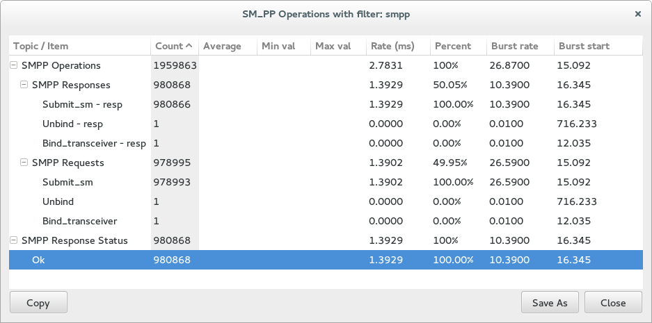
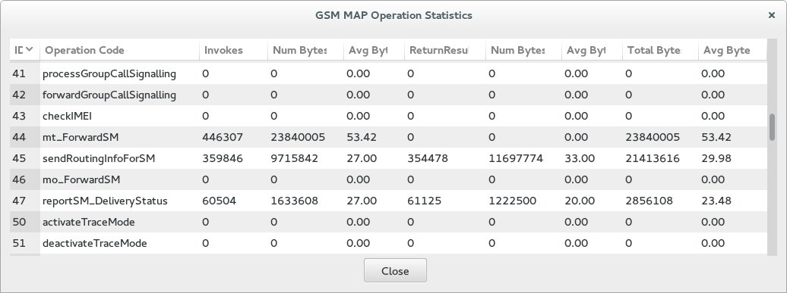
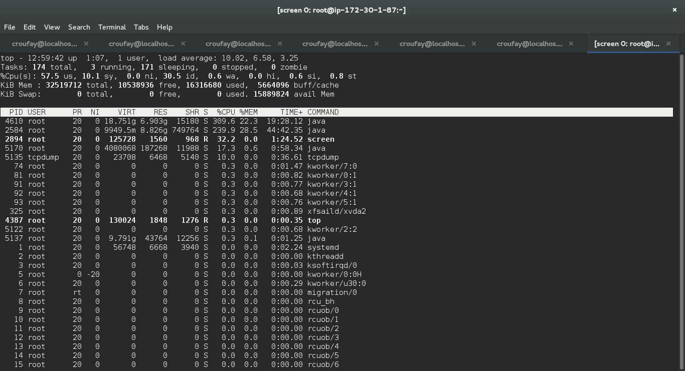
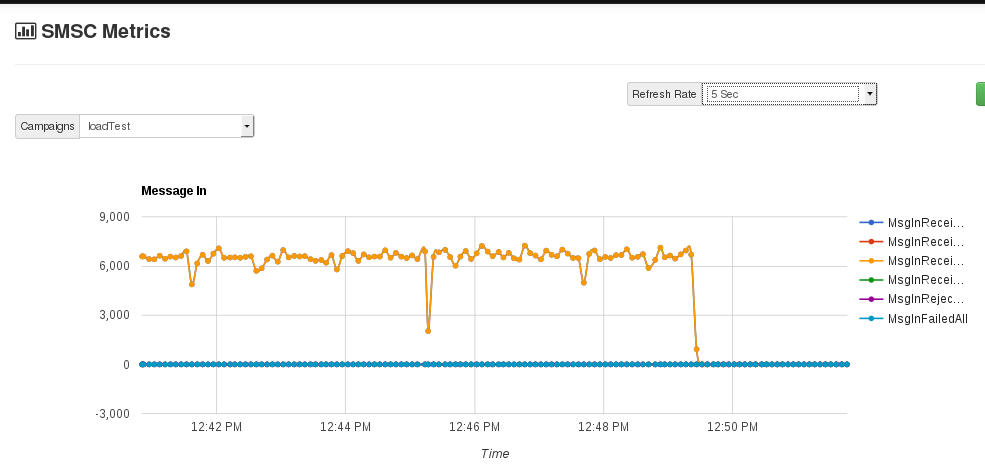
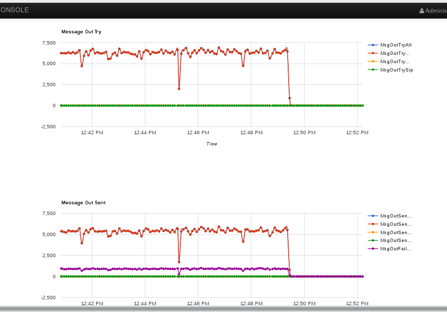

This tutorial will show you how to run Load Test on Restcomm SMSC Gateway.

[[amazon-cloud-server-specification]]
Amazon Cloud Server specification
^^^^^^^^^^^^^^^^^^^^^^^^^^^^^^^^^

[cols=",,,,",]
|=========================================================================
|Model |vCPU |Mem (GiB) |SSD Storage (GB) |Dedicated EBS Throughput (Mbps)
|m4.2xlarge |8 |32 |EBS-only |1,000
|=========================================================================

[[server-configuration]]
Server configuration
^^^^^^^^^^^^^^^^^^^^

* Java version JDK version 7
* Install screen
* Install ant
* Restcomm version Restcomm-smsc-6.2.2.672
* Cassandra apache-cassandra-2.0.17-src.tar.gz
* JAVA_OPTS=”-Xms12g -Xmx12g -XX:MaxPermSize=256m -Dorg.jboss.resolver.warning=true -Dsun.rmi.dgc.client.gcInterval=3600000 -Dsun.rmi.dgc.server.gcInterval=3600000″

NOTE: You must have *screen* install on the server in order to be able to toggle between multiple process window.

[[load-test-Restcomm-smsc-and-cassandra-db-on-the-same-server]]
Load Test Restcomm SMSC and Cassandra DB on the Same Server
~~~~~~~~~~~~~~~~~~~~~~~~~~~~~~~~~~~~~~~~~~~~~~~~~~~~~~~~~~~

[[step-1---monitor-cpu-and-memory-usage]]
Step 1 - Monitor CPU and Memory Usage
^^^^^^^^^^^^^^^^^^^^^^^^^^^^^^^^^^^^^

* *screen -S cpu*
* run command *top*

[[step-2---configure-and-start-cassandra-db]]
Step 2 - Configure and Start Cassandra DB
^^^^^^^^^^^^^^^^^^^^^^^^^^^^^^^^^^^^^^^^^

* *screen -S cassandra* 
+
change log to WARN
* Edit the file  */root/apache-cassandra-2.0.16/conf/log4j-server.properties* 
+
# output messages into a rolling log file as well as stdout
+
*log4j.rootLogger=WARN,stdout,R*
* Got to */root/apache-cassandra-2.0.16/bin*
* Start cassandra as follows 
----
./cassandra -f
----

[[step-3---configure-and-start-Restcomm-smsc]]
Step 3 - Configure and Start Restcomm SMSC
^^^^^^^^^^^^^^^^^^^^^^^^^^^^^^^^^^^^^^^^^^

* *screen -S smsc*
* Edit the file */root/Restcomm-smsc-6.2.2.695/jboss-5.1.0.GA/server/simulator/conf/jboss-log4j.xml* 
+
change all INFO value to WARN
* Go to the directory */root/Restcomm-smsc-6.2.2.695/jboss-5.1.0.GA/bin* 
----
./run.sh -b 172.30.1.87 -c simulator
----

This will start SMSC in simulator mode and bind it to the local IP address of the server

[[step-4---start-packet-trace-with-tcpdump]]
Step 4 - Start Packet Trace with TCPDUMP
^^^^^^^^^^^^^^^^^^^^^^^^^^^^^^^^^^^^^^^^

* *screen -S tcpdump*
* *sudo tcpdump -i any -w filename1.000.000.pcap -s 0 -vvv*

[[step-5---start-hlr]]
Step 5 - Start HLR
^^^^^^^^^^^^^^^^^^

* *screen -S hlr*
* Go to the directory */root/Restcomm-smsc-6.2.2.695/tools/Restcomm-hlr-simulator/bin/*
* Edit the file telestax-license.xml
* Add some random text in the tag *<licenseKey>testlicense</licenseKey>*
* Start the HLR tool as follows
* *../run.sh*

[[step-6---configure-smpp-load-and-send-traffic]]
Step 6 - Configure Smpp Load and Send Traffic
^^^^^^^^^^^^^^^^^^^^^^^^^^^^^^^^^^^^^^^^^^^^^

* *screen -S load*
* Go to */root/Restcomm-smsc-6.2.2.695/tools/Restcomm-smpp-load/*
* Edit the file */root/Restcomm-smsc-6.2.2.695/tools/Restcomm-smpp-load/build.xml*
* Set the amount of SMSC to send as follows (below we shall be sending 1 million messages)
* change the setting in the file build.xml 
----
<!-- SUBMIT_SM to send --> 
<arg value="1000000" />
----

[[result-of-sending-1-million-sms]]
Result of Sending 1 Million SMS
^^^^^^^^^^^^^^^^^^^^^^^^^^^^^^^

[source,lang:default,decode:true]
----
client:
     [echo] /root/Restcomm-smsc-6.2.2.695/tools/Restcomm-smpp-load/target/load/smpp-load-6.2.2.695.jar:/root/Restcomm-smsc-6.2.2.695/tools/Restcomm-smpp-load/target/load/ch-smpp-5.0.7.GA-Restcomm.jar:/root/Restcomm-smsc-6.2.2.695/tools/Restcomm-smpp-load/target/load/netty-3.9.0.Final.jar:/root/Restcomm-smsc-6.2.2.695/tools/Restcomm-smpp-load/target/load/slf4j-api-1.5.6.jar:/root/Restcomm-smsc-6.2.2.695/tools/Restcomm-smpp-load/target/load/slf4j-log4j12-1.5.6.jar:/root/Restcomm-smsc-6.2.2.695/tools/Restcomm-smpp-load/target/load/ch-commons-charset-3.0.2.jar:/root/Restcomm-smsc-6.2.2.695/tools/Restcomm-smpp-load/target/load/ch-commons-util-6.0.1.jar:/root/Restcomm-smsc-6.2.2.695/tools/Restcomm-smpp-load/target/load/joda-time-2.6.jar:/root/Restcomm-smsc-6.2.2.695/tools/Restcomm-smpp-load/target/load/log4j-1.2.14.jar:/root/Restcomm-smsc-6.2.2.695/tools/Restcomm-smpp-load/src/main/resources
   [delete] Deleting directory /root/Restcomm-smsc-6.2.2.695/tools/Restcomm-smpp-load/client
    [mkdir] Created dir: /root/Restcomm-smsc-6.2.2.695/tools/Restcomm-smpp-load/client
     [java] Input Stream = sun.net.www.protocol.jar.JarURLConnection$JarURLInputStream@1b8f2e35
     [java] 0    [main] INFO  org.mobicents.protocols.smpp.load.Client  - sessionCount=1
     [java] 4    [main] INFO  org.mobicents.protocols.smpp.load.Client  - windowSize=10000
     [java] 4    [main] INFO  org.mobicents.protocols.smpp.load.Client  - submitToSend=1000000
     [java] 5    [main] INFO  org.mobicents.protocols.smpp.load.Client  - startDestNumber=9960200000
     [java] 5    [main] INFO  org.mobicents.protocols.smpp.load.Client  - destNumberDiff=10000
     [java] 6    [main] INFO  org.mobicents.protocols.smpp.load.Client  - endDestNumber=9960210000
     [java] 6    [main] INFO  org.mobicents.protocols.smpp.load.Client  - sourceNumber=6666
     [java] 6    [main] INFO  org.mobicents.protocols.smpp.load.Client  - peerAddress=127.0.0.1
     [java] 7    [main] INFO  org.mobicents.protocols.smpp.load.Client  - peerPort=2776
     [java] 7    [main] INFO  org.mobicents.protocols.smpp.load.Client  - systemId=test
     [java] 8    [main] INFO  org.mobicents.protocols.smpp.load.Client  - password=test
     [java] 8    [main] INFO  org.mobicents.protocols.smpp.load.Client  - message=Hello World
     [java] 96   [main] INFO  org.mobicents.protocols.smpp.load.Client  - Waiting up to 7 seconds for all sessions to bind...
     [java] 402  [main] INFO  org.mobicents.protocols.smpp.load.Client  - Sending signal to start test...

[java] 624643 [pool-5-thread-1] INFO  org.mobicents.protocols.smpp.load.Client  - before waiting sendWindow.size: 0
     [java] 624653 [pool-5-thread-1] INFO  org.mobicents.protocols.smpp.load.Client  - Final Session rx-submitSM[request=0 expired=0 response=0 avgWaitTime=0.0ms avgResponseTime=0.0ms avgEstimatedProcessingTime=0.0ms cmdStatus=[]]
     [java] 624656 [pool-5-thread-1] INFO  org.mobicents.protocols.smpp.load.Client  - Final Session tx-submitSM[request=1000000 expired=0 response=1000000 avgWaitTime=0.5ms avgResponseTime=6030.1ms avgEstimatedProcessingTime=0.2ms cmdStatus=[0=1000000]]
     [java] 624657 [pool-5-thread-1] INFO  org.mobicents.protocols.smpp.load.Client  - after waiting sendWindow.size: 0
     [java] 624661 [main] INFO  org.mobicents.protocols.smpp.load.Client  - Performance client finished:
     [java] 624661 [main] INFO  org.mobicents.protocols.smpp.load.Client  -        Sessions: 1
     [java] 624662 [main] INFO  org.mobicents.protocols.smpp.load.Client  -     Window Size: 10000
     [java] 624662 [main] INFO  org.mobicents.protocols.smpp.load.Client  - Sessions Failed: 0
     [java] 624663 [main] INFO  org.mobicents.protocols.smpp.load.Client  -            Time: 624258 ms
     [java] 624663 [main] INFO  org.mobicents.protocols.smpp.load.Client  -   Target Submit: 1000000
     [java] 624663 [main] INFO  org.mobicents.protocols.smpp.load.Client  -   Actual Submit: 1000000
     [java] 624664 [main] INFO  org.mobicents.protocols.smpp.load.Client  -   Throttled Message count: 0
     [java] 624666 [main] INFO  org.mobicents.protocols.smpp.load.Client  -      Throughput: 1601.902 per sec
     [java] 624667 [main] INFO  org.mobicents.protocols.smpp.load.Client  -  Session 0: submitSM [request=1000000 expired=0 response=1000000 avgWaitTime=0.5ms avgResponseTime=6030.1ms avgEstimatedProcessingTime=0.2ms cmdStatus=[0=1000000]]
     [java] 624667 [main] INFO  org.mobicents.protocols.smpp.load.Client  - Shutting down client bootstrap and executors...
     [java] 624675 [main] INFO  org.mobicents.protocols.smpp.load.Client  - Done. Exiting

BUILD SUCCESSFUL
Total time: 10 minutes 25 seconds
----

Notice the result.

* *Average of 1601 message per second*

[[result-of-sending-500.000-sms]]
Result of Sending 500.000 SMS
^^^^^^^^^^^^^^^^^^^^^^^^^^^^^

Edit build.xml file 
----
<!-- SUBMIT_SM to send --> 
<arg value="500000" />
----

[source,lang:default,decode:true]
----
Sending signal to start test...
     [java] 297830 [pool-5-thread-1] INFO  org.mobicents.protocols.smpp.load.Client  - before waiting sendWindow.size: 0
     [java] 297839 [pool-5-thread-1] INFO  org.mobicents.protocols.smpp.load.Client  - Final Session rx-submitSM[request=0 expired=0 response=0 avgWaitTime=0.0ms avgResponseTime=0.0ms avgEstimatedProcessingTime=0.0ms cmdStatus=[]]
     [java] 297842 [pool-5-thread-1] INFO  org.mobicents.protocols.smpp.load.Client  - Final Session tx-submitSM[request=500000 expired=0 response=500000 avgWaitTime=0.4ms avgResponseTime=5740.0ms avgEstimatedProcessingTime=0.1ms cmdStatus=[0=500000]]
     [java] 297843 [pool-5-thread-1] INFO  org.mobicents.protocols.smpp.load.Client  - after waiting sendWindow.size: 0
     [java] 297847 [main] INFO  org.mobicents.protocols.smpp.load.Client  - Performance client finished:
     [java] 297847 [main] INFO  org.mobicents.protocols.smpp.load.Client  -        Sessions: 1
     [java] 297848 [main] INFO  org.mobicents.protocols.smpp.load.Client  -     Window Size: 10000
     [java] 297848 [main] INFO  org.mobicents.protocols.smpp.load.Client  - Sessions Failed: 0
     [java] 297848 [main] INFO  org.mobicents.protocols.smpp.load.Client  -            Time: 297694 ms
     [java] 297849 [main] INFO  org.mobicents.protocols.smpp.load.Client  -   Target Submit: 500000
     [java] 297849 [main] INFO  org.mobicents.protocols.smpp.load.Client  -   Actual Submit: 500000
     [java] 297849 [main] INFO  org.mobicents.protocols.smpp.load.Client  -   Throttled Message count: 0
     [java] 297851 [main] INFO  org.mobicents.protocols.smpp.load.Client  -      Throughput: 1679.577 per sec
     [java] 297852 [main] INFO  org.mobicents.protocols.smpp.load.Client  -  Session 0: submitSM [request=500000 expired=0 response=500000 avgWaitTime=0.4ms avgResponseTime=5740.0ms avgEstimatedProcessingTime=0.1ms cmdStatus=[0=500000]]
     [java] 297852 [main] INFO  org.mobicents.protocols.smpp.load.Client  - Shutting down client bootstrap and executors...
     [java] 297857 [main] INFO  org.mobicents.protocols.smpp.load.Client  - Done. Exiting

BUILD SUCCESSFUL
Total time: 4 minutes 59 seconds
----

Notice the result.

* *Average of 1679 message per second*

[[result-of-sending-100.000-sms]]
Result of Sending 100.000 SMS
^^^^^^^^^^^^^^^^^^^^^^^^^^^^^

Edit build.xml file 
----
<!-- SUBMIT_SM to send --> 
<arg value="100000" />
----

[source,lang:default,decode:true]
----
 Sending signal to start test...
     [java] 58146 [pool-5-thread-1] INFO  org.mobicents.protocols.smpp.load.Client  - before waiting sendWindow.size: 0
     [java] 58154 [pool-5-thread-1] INFO  org.mobicents.protocols.smpp.load.Client  - Final Session rx-submitSM[request=0 expired=0 response=0 avgWaitTime=0.0ms avgResponseTime=0.0ms avgEstimatedProcessingTime=0.0ms cmdStatus=[]]
     [java] 58157 [pool-5-thread-1] INFO  org.mobicents.protocols.smpp.load.Client  - Final Session tx-submitSM[request=100000 expired=0 response=100000 avgWaitTime=0.4ms avgResponseTime=5214.0ms avgEstimatedProcessingTime=0.0ms cmdStatus=[0=100000]]
     [java] 58158 [pool-5-thread-1] INFO  org.mobicents.protocols.smpp.load.Client  - after waiting sendWindow.size: 0
     [java] 58162 [main] INFO  org.mobicents.protocols.smpp.load.Client  - Performance client finished:
     [java] 58162 [main] INFO  org.mobicents.protocols.smpp.load.Client  -        Sessions: 1
     [java] 58163 [main] INFO  org.mobicents.protocols.smpp.load.Client  -     Window Size: 10000
     [java] 58163 [main] INFO  org.mobicents.protocols.smpp.load.Client  - Sessions Failed: 0
     [java] 58163 [main] INFO  org.mobicents.protocols.smpp.load.Client  -            Time: 57999 ms
     [java] 58164 [main] INFO  org.mobicents.protocols.smpp.load.Client  -   Target Submit: 100000
     [java] 58164 [main] INFO  org.mobicents.protocols.smpp.load.Client  -   Actual Submit: 100000
     [java] 58165 [main] INFO  org.mobicents.protocols.smpp.load.Client  -   Throttled Message count: 0
     [java] 58169 [main] INFO  org.mobicents.protocols.smpp.load.Client  -      Throughput: 1724.168 per sec
     [java] 58170 [main] INFO  org.mobicents.protocols.smpp.load.Client  -  Session 0: submitSM [request=100000 expired=0 response=100000 avgWaitTime=0.4ms avgResponseTime=5214.0ms avgEstimatedProcessingTime=0.0ms cmdStatus=[0=100000]]
     [java] 58170 [main] INFO  org.mobicents.protocols.smpp.load.Client  - Shutting down client bootstrap and executors...
     [java] 58176 [main] INFO  org.mobicents.protocols.smpp.load.Client  - Done. Exiting

BUILD SUCCESSFUL
Total time: 59 seconds
----

Notice the result.

* *Average of 1724 message per second*

[[result-of-sending-100.000-sms-1]]
Result of Sending 100.000 SMS
^^^^^^^^^^^^^^^^^^^^^^^^^^^^^

Edit build.xml file 
----
<!-- SUBMIT_SM to send --> 
<arg value="50000" />
----

[source,lang:default,decode:true]
----
Sending signal to start test...
     [java] 20771 [pool-5-thread-1] INFO  org.mobicents.protocols.smpp.load.Client  - before waiting sendWindow.size: 0
     [java] 20780 [pool-5-thread-1] INFO  org.mobicents.protocols.smpp.load.Client  - Final Session rx-submitSM[request=0 expired=0 response=0 avgWaitTime=0.0ms avgResponseTime=0.0ms avgEstimatedProcessingTime=0.0ms cmdStatus=[]]
     [java] 20782 [pool-5-thread-1] INFO  org.mobicents.protocols.smpp.load.Client  - Final Session tx-submitSM[request=50000 expired=0 response=50000 avgWaitTime=0.2ms avgResponseTime=2954.0ms avgEstimatedProcessingTime=0.0ms cmdStatus=[0=50000]]
     [java] 20782 [pool-5-thread-1] INFO  org.mobicents.protocols.smpp.load.Client  - after waiting sendWindow.size: 0
     [java] 20786 [main] INFO  org.mobicents.protocols.smpp.load.Client  - Performance client finished:
     [java] 20786 [main] INFO  org.mobicents.protocols.smpp.load.Client  -        Sessions: 1
     [java] 20787 [main] INFO  org.mobicents.protocols.smpp.load.Client  -     Window Size: 10000
     [java] 20787 [main] INFO  org.mobicents.protocols.smpp.load.Client  - Sessions Failed: 0
     [java] 20787 [main] INFO  org.mobicents.protocols.smpp.load.Client  -            Time: 20634 ms
     [java] 20788 [main] INFO  org.mobicents.protocols.smpp.load.Client  -   Target Submit: 50000
     [java] 20788 [main] INFO  org.mobicents.protocols.smpp.load.Client  -   Actual Submit: 50000
     [java] 20789 [main] INFO  org.mobicents.protocols.smpp.load.Client  -   Throttled Message count: 0
     [java] 20790 [main] INFO  org.mobicents.protocols.smpp.load.Client  -      Throughput: 2423.185 per sec
     [java] 20790 [main] INFO  org.mobicents.protocols.smpp.load.Client  -  Session 0: submitSM [request=50000 expired=0 response=50000 avgWaitTime=0.2ms avgResponseTime=2954.0ms avgEstimatedProcessingTime=0.0ms cmdStatus=[0=50000]]
     [java] 20791 [main] INFO  org.mobicents.protocols.smpp.load.Client  - Shutting down client bootstrap and executors...
     [java] 20797 [main] INFO  org.mobicents.protocols.smpp.load.Client  - Done. Exiting

BUILD SUCCESSFUL
Total time: 21 seconds
----

Notice the result.

* *Average of 2423 message per second*

[[result-from-packet-tcpdump]]
Result from Packet Tcpdump
^^^^^^^^^^^^^^^^^^^^^^^^^^

[[smpp-operations-summary]]
SMPP Operations Summary
+++++++++++++++++++++++

[[gsm-map-operations]]
GSM Map Operations
^^^^^^^^^^^^^^^^^^

[[result-cpu-usage]]
Result CPU Usage
^^^^^^^^^^^^^^^^

CPU usage constantly oscillated between 55 and 60 percent

[[smsc-metrics-from-the-Restcomm-smsc-admin-ui]]
SMSC Metrics from the Restcomm SMSC Admin UI
^^^^^^^^^^^^^^^^^^^^^^^^^^^^^^^^^^^^^^^^^^^^

[[load-test-Restcomm-smsc-and-cassandra-db-on-separate-servers]]
Load Test Restcomm SMSC and Cassandra DB on Separate Servers
~~~~~~~~~~~~~~~~~~~~~~~~~~~~~~~~~~~~~~~~~~~~~~~~~~~~~~~~~~~~

On the first server that will host the Cassandra DB, you need to make modifications to the **/root/apache-cassandra-2.0.16/conf/cassandra.yaml** to allow Cassandra DB to bind to a routable IP instead of the localhost.

Change

* *listen_address: localhost*
* *rpc_address:* *localhost*

to the local IP address of the server ex.

* * listen_address: 172.30.1.160*
* *rpc_address: 172.30.1.160*

Start Cassandra as mentioned above in *Step 2*

On the server that will host Restcomm SMSC Gateway, you must point to the IP address of the Cassandra server to which the SMSC gateway  must connect.

*  Edit the file /Restcomm-smsc-6.2.2.664/jboss-5.1.0.GA/server/simulator/data/SmscManagement_smscproperties.xml
* Search for this line *<dbHosts value="127.0.0.1"/>*
* Change the loopback *"127.0.0.1"* IP to the IP address of the Cassandra DB server.

IMPORTANT: *If you are on Amazon EC2, make sure your Security Group allows the appropriate ports and traffic between SMSC gateway and Cassandra DB using the local IP address*

[[result-of-sending-1.000.000-sms]]
Result of Sending 1.000.000 SMS
^^^^^^^^^^^^^^^^^^^^^^^^^^^^^^^

* 1 minute 30 seconds slower due to Network Latency
* Throughput: 1420.067 per sec which is about 200 messages lesser and running both SMSC and Cassandra on the same server

[source,lang:default,decode:true]
----
Sending signal to start test...
     [java] 704331 [pool-5-thread-1] INFO  org.mobicents.protocols.smpp.load.Client  - before waiting sendWindow.size: 0
     [java] 704339 [pool-5-thread-1] INFO  org.mobicents.protocols.smpp.load.Client  - Final Session rx-submitSM[request=0 expired=0 response=0 avgWaitTime=0.0ms avgResponseTime=0.0ms avgEstimatedProcessingTime=0.0ms cmdStatus=[]]
     [java] 704342 [pool-5-thread-1] INFO  org.mobicents.protocols.smpp.load.Client  - Final Session tx-submitSM[request=1000000 expired=0 response=1000000 avgWaitTime=0.5ms avgResponseTime=6904.1ms avgEstimatedProcessingTime=0.3ms cmdStatus=[0=1000000]]
     [java] 704343 [pool-5-thread-1] INFO  org.mobicents.protocols.smpp.load.Client  - after waiting sendWindow.size: 0
     [java] 704346 [main] INFO  org.mobicents.protocols.smpp.load.Client  - Performance client finished:
     [java] 704346 [main] INFO  org.mobicents.protocols.smpp.load.Client  -        Sessions: 1
     [java] 704346 [main] INFO  org.mobicents.protocols.smpp.load.Client  -     Window Size: 10000
     [java] 704347 [main] INFO  org.mobicents.protocols.smpp.load.Client  - Sessions Failed: 0
     [java] 704347 [main] INFO  org.mobicents.protocols.smpp.load.Client  -            Time: 704192 ms
     [java] 704347 [main] INFO  org.mobicents.protocols.smpp.load.Client  -   Target Submit: 1000000
     [java] 704347 [main] INFO  org.mobicents.protocols.smpp.load.Client  -   Actual Submit: 1000000
     [java] 704348 [main] INFO  org.mobicents.protocols.smpp.load.Client  -   Throttled Message count: 0
     [java] 704349 [main] INFO  org.mobicents.protocols.smpp.load.Client  -      Throughput: 1420.067 per sec
     [java] 704350 [main] INFO  org.mobicents.protocols.smpp.load.Client  -  Session 0: submitSM [request=1000000 expired=0 response=1000000 avgWaitTime=0.5ms avgResponseTime=6904.1ms avgEstimatedProcessingTime=0.3ms cmdStatus=[0=1000000]]
     [java] 704350 [main] INFO  org.mobicents.protocols.smpp.load.Client  - Shutting down client bootstrap and executors...
     [java] 704355 [main] INFO  org.mobicents.protocols.smpp.load.Client  - Done. Exiting

BUILD SUCCESSFUL
Total time: 11 minutes 45 seconds
----

[[result-of-sending-500.000-sms-1]]
Result of Sending 500.000 SMS
^^^^^^^^^^^^^^^^^^^^^^^^^^^^^

[source,lang:default,decode:true]
----
Sending signal to start test...
     [java] 378225 [pool-5-thread-1] INFO  org.mobicents.protocols.smpp.load.Client  - before waiting sendWindow.size: 0
     [java] 378238 [pool-5-thread-1] INFO  org.mobicents.protocols.smpp.load.Client  - Final Session rx-submitSM[request=0 expired=0 response=0 avgWaitTime=0.0ms avgResponseTime=0.0ms avgEstimatedProcessingTime=0.0ms cmdStatus=[]]
     [java] 378242 [pool-5-thread-1] INFO  org.mobicents.protocols.smpp.load.Client  - Final Session tx-submitSM[request=500000 expired=0 response=500000 avgWaitTime=0.5ms avgResponseTime=7379.5ms avgEstimatedProcessingTime=0.0ms cmdStatus=[0=500000]]
     [java] 378243 [pool-5-thread-1] INFO  org.mobicents.protocols.smpp.load.Client  - after waiting sendWindow.size: 0
     [java] 378247 [main] INFO  org.mobicents.protocols.smpp.load.Client  - Performance client finished:
     [java] 378248 [main] INFO  org.mobicents.protocols.smpp.load.Client  -        Sessions: 1
     [java] 378248 [main] INFO  org.mobicents.protocols.smpp.load.Client  -     Window Size: 10000
     [java] 378248 [main] INFO  org.mobicents.protocols.smpp.load.Client  - Sessions Failed: 0
     [java] 378249 [main] INFO  org.mobicents.protocols.smpp.load.Client  -            Time: 378095 ms
     [java] 378249 [main] INFO  org.mobicents.protocols.smpp.load.Client  -   Target Submit: 500000
     [java] 378250 [main] INFO  org.mobicents.protocols.smpp.load.Client  -   Actual Submit: 500000
     [java] 378250 [main] INFO  org.mobicents.protocols.smpp.load.Client  -   Throttled Message count: 0
     [java] 378253 [main] INFO  org.mobicents.protocols.smpp.load.Client  -      Throughput: 1322.419 per sec
     [java] 378253 [main] INFO  org.mobicents.protocols.smpp.load.Client  -  Session 0: submitSM [request=500000 expired=0 response=500000 avgWaitTime=0.5ms avgResponseTime=7379.5ms avgEstimatedProcessingTime=0.0ms cmdStatus=[0=500000]]
     [java] 378254 [main] INFO  org.mobicents.protocols.smpp.load.Client  - Shutting down client bootstrap and executors...
     [java] 378262 [main] INFO  org.mobicents.protocols.smpp.load.Client  - Done. Exiting

BUILD SUCCESSFUL
Total time: 6 minutes 19 seconds
----

[[result-of-sending-100.000-sms-2]]
Result of Sending 100.000 SMS
^^^^^^^^^^^^^^^^^^^^^^^^^^^^^

[source,lang:default,decode:true]
----
     [java] 68273 [pool-5-thread-1] INFO  org.mobicents.protocols.smpp.load.Client  - before waiting sendWindow.size: 0
     [java] 68283 [pool-5-thread-1] INFO  org.mobicents.protocols.smpp.load.Client  - Final Session rx-submitSM[request=0 expired=0 response=0 avgWaitTime=0.0ms avgResponseTime=0.0ms avgEstimatedProcessingTime=0.0ms cmdStatus=[]]
     [java] 68291 [pool-5-thread-1] INFO  org.mobicents.protocols.smpp.load.Client  - Final Session tx-submitSM[request=100000 expired=0 response=100000 avgWaitTime=0.4ms avgResponseTime=6317.9ms avgEstimatedProcessingTime=0.0ms cmdStatus=[0=100000]]
     [java] 68292 [pool-5-thread-1] INFO  org.mobicents.protocols.smpp.load.Client  - after waiting sendWindow.size: 0
     [java] 68304 [main] INFO  org.mobicents.protocols.smpp.load.Client  - Performance client finished:
     [java] 68305 [main] INFO  org.mobicents.protocols.smpp.load.Client  -        Sessions: 1
     [java] 68305 [main] INFO  org.mobicents.protocols.smpp.load.Client  -     Window Size: 10000
     [java] 68305 [main] INFO  org.mobicents.protocols.smpp.load.Client  - Sessions Failed: 0
     [java] 68306 [main] INFO  org.mobicents.protocols.smpp.load.Client  -            Time: 68131 ms
     [java] 68306 [main] INFO  org.mobicents.protocols.smpp.load.Client  -   Target Submit: 100000
     [java] 68307 [main] INFO  org.mobicents.protocols.smpp.load.Client  -   Actual Submit: 100000
     [java] 68307 [main] INFO  org.mobicents.protocols.smpp.load.Client  -   Throttled Message count: 0
     [java] 68309 [main] INFO  org.mobicents.protocols.smpp.load.Client  -      Throughput: 1467.761 per sec
     [java] 68310 [main] INFO  org.mobicents.protocols.smpp.load.Client  -  Session 0: submitSM [request=100000 expired=0 response=100000 avgWaitTime=0.4ms avgResponseTime=6317.9ms avgEstimatedProcessingTime=0.0ms cmdStatus=[0=100000]]
     [java] 68310 [main] INFO  org.mobicents.protocols.smpp.load.Client  - Shutting down client bootstrap and executors...
     [java] 68317 [main] INFO  org.mobicents.protocols.smpp.load.Client  - Done. Exiting

BUILD SUCCESSFUL
Total time: 1 minute 9 seconds
----

[[conclusion]]
Conclusion
~~~~~~~~~~

From the load test conducted using Restcomm SMSC Gateway and Cassandra DB, there is a 50 percent increase in SMS throughput when log4 settings are changed from INFO to WARN. This change also prevents the server logs from using up all the available disk space. 

Putting the Cassandra DB on a different server doesn't seem to change the amount of CPU cycle. It often oscillate between 55 to 60 percent CPU usage when under heavy load. Another reason for the high CPU usage is because the SMPP and HLR load test clients ran on the same server as the SMSC gateway. Moving the Cassandra DB to a different server didn't impact CPU usage. 

When the Cassandra DB was moved to a different server on the same Amazon Cloud, there was a decrease in SMS throughput which can be attributed to network latency. 

Here is a Table of SMS throughput summary of the results  

[cols=",,,,",]
|=====================================================================================================
| |*Everything on a Single Server* |DB on a Separate Server | |
|Amount of SMS Processed |*SMS throuhput per second* |SMS throuhput per second |Difference |Decrease %
|1 Million |*1679.577* |1420.067 |259.51 |15.45091413
|500 Thousand |*1724.168* |1322.419 |401.749 |23.30103563
|100 Thousand |*2423.185* |1467.761 |955.424 |39.42843819
|=====================================================================================================
