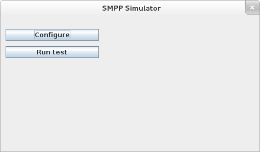

Installing Restcomm SMSC Gateway is easy and quick with the binary download. You can either download the binary release or download the source code and set up from source.

[[requirements]]
= Requirements

* Download the latest Cassandra Database from link:http://cassandra.apache.org/download/[HERE]
* Download the latest Restcomm SMSC gateway from link:https://github.com/RestComm/smscgateway#downloads[HERE]
* Install Java JDK 7 or higher
* Make sure $JAVA_HOME environment variable is correctly set (test: echo $JAVA_HOME)

[[step-1---download-and-unzip-the-telscale-smsc-gateway-binary]]
== Step 1 - Download and Unzip the Restcomm SMSC Gateway Binary

* Once you have the SMSC binary, run the unzip command (This tutorial will be using the version restcomm-smsc-X.Y.Z.zip)
* *unzip restcomm-smsc-X.Y.Z.zip*
* This will create a directory  with the name: restcomm-smsc-X.Y.Z
* cd into the restcomm-smsc-X.Y.Z and you will see the following directory structure:

[source,lang:default,decode:true]
----
 restcomm-smsc-X.Y.Z]$ ls
cassandra  docs  jboss-5.1.0.GA  resources  tools
----

* This root directory  restcomm-smsc-X.Y.Z will be referred to as the *$SMSC_HOME*

[[step-2---download-and-unzip-cassandra-db]]
= Step 2 - Download and unzip Cassandra DB

* Get the latest Cassandra DB binary link and run the command
* *wget http://mirrors.ucr.ac.cr/apache/cassandra/2.1.8/apache-cassandra-2.1.8-bin.tar.gz*
* Extract the content of the file to your local directory
* *tar -xvf apache-cassandra-2.1.8-bin.tar.gz*
* This will create a directory called *apache-cassandra-2.1.8*
* The content of the file should be similar to the content below:

[source,lang:default,decode:true]
----
apache-cassandra-2.1.8]$ ls
bin  CHANGES.txt  conf  interface  javadoc  lib  LICENSE.txt  NEWS.txt  NOTICE.txt  pylib  tools
----

*  This root directory of apache-cassandra will be referred to as the *$CASSANDRA_HOME*
* Go to *$CASSANDRA_HOME/bin*
* start Cassandra as follows:
* *./cassandra -f*
* if Cassandra is successfully started, the console final output should be similar to the following:

[source,lang:default,decode:true]
----
Starting listening for CQL clients on localhost/127.0.0.1:9042...
INFO  18:20:39 Binding thrift service to localhost/127.0.0.1:9160
INFO  18:20:39 Listening for thrift clients...
----

* Open a different bash terminal and go to the directory *$CASSANDRA_HOME/bin*
* Run the following command to create a database for the Restcomm SMSC gateway
* Create the Keyspace TelestaxSMSC

[source,lang:default,decode:true]
----
./cqlsh CREATE KEYSPACE "TelestaxSMSC" WITH REPLICATION = {'class' : 'SimpleStrategy', 'replication_factor': 1};
----

* Restcomm SMSC will populate the database on startup.

[[step-3---start-telscale-smsc-gateway]]
= Step 3 - Start Restcomm SMSC Gateway

* Create a  JBOSS_HOME  environment variable to point to the directory  $SMSC_HOME/jboss-5.1.0.GA/
* Go to the directory *$SMSC_HOME/jboss-5.1.0.GA/bin*
* Run the following command to start the SMSC gateway :
* *./run.sh -c simulator*
* This will start in simulator mode so that you can quickly test the demo scenarios of SMSC
* If successfully started, you should see a console output similar to the one below:

[source,lang:default,decode:true]
----
13:27:33,551 INFO  [Http11Protocol] (main) Starting Coyote HTTP/1.1 on http-127.0.0.1-8080
13:27:33,607 INFO  [AjpProtocol] (main) Starting Coyote AJP/1.3 on ajp-127.0.0.1-8009
13:27:33,621 INFO  [ServerImpl] (main) JBoss (Microcontainer) [5.1.0.GA (build: SVNTag=JBoss_5_1_0_GA date=200905221634)] Started in 58s:285ms
----

'''''

NOTE: that the the Restcomm SMSC gateway is bound to the local loopback address (127.0.0.1). You can bind it to another IP address by running the command : *$SMSC_HOME/jboss-5.1.0.GA/bin/run.sh -b <IP_ADDRESS>*

'''''

[[step-4---access-the-telscale-smsc-management-gui]]
= Step 4 - Access the Restcomm SMSC Management Gui

* Open your web browser and go to *http://127.0.0.1:8080/smsc-management/*

You will see a screenshot similar to the one below http://docs.telestax.com/wp-content/uploads/2014/09/smsc-gui.png[image:http://docs.telestax.com/wp-content/uploads/2014/09/smsc-gui.png[smsc-gui,width=621,height=438]]

[[step-5---sending-a-message-from-the-smpp-simulator-to-the-telscale-smsc-gateway]]
= Step 5 - Sending a message from the SMPP Simulator to the Restcomm SMSC gateway

* In the SMSC Gui, click on  *ESMEs* on the left hand pane,
* Click on the button *Create ESME*
* Fill out the fields as shown below and leave the rest as default

[source,lang:default,decode:true]
----
ESME Name : test
System Id : test
Password  : test
Network : -1
IP Address : -1
Port : -1
Smpp Session Type : SERVER
ESME Range: 6666
Source Range: 6666
----

* Save the test ESME and click on the *start* button to activate the test ESME you have just created
* Start the SMPP simulator and bound it to the test ESME you just created
* Go to the directory ** $SMSC_HOME/**tools/TelScale-smpp-simulator/bin
* run the command the following command
* *./run.sh*
* This will start the SMPP Simulator Window

* Click on the button *Configure*
* Make sure the SMSC Host is pointing to 127.0.0.1, which is the address on which the Restcomm SMSC gateway is running
* Exit that window and click on the button *Run test*
* Click on the button *Start Session*
* This will start an SMPP session with the Restcomm SMSC server.
* You can click on the button "**Submit a Message"** to send a message to the console **
* You can also click on the "**Configure data for a message submitting** " to modify the message to send
* Your message will appear in the Restcomm SMSC gateway console but it will be encoded

The above only connects  an SMPP endpoint to the Restcomm SMSC Gateway. See the section below to learn how to configure advanced features:

[[telestax-sending-messages-from-jss7-to-smpp-through-telscale-smsc-gateway]]
= Sending Messages from JSS7 to SMPP through Restcomm SMSC Gateway

video::KwvivC6CNG0[youtube, width=640, height=480]

[[telestax-sending-messages-from-jss7-and-smpp-to-a-sip-phone-through-telscale-smsc-gateway]]
= Telestax Sending Messages from JSS7 and SMPP to a SIP Phone through Restcomm SMSC Gateway

video::wmvlw549LA0[youtube, width=640, height=480]

[[additional-information]]
= Additional Information

* You can read the Introduction to Restcomm SMSC overview link:http://docs.telestax.com/smsc-introduction-to-telscale-smsc-gateway/[HERE]
* You can read about supported hardware link:http://docs.telestax.com/smsc-prerequisite-and-setup/[HERE]
* You can read more about running in Simulator mode link:http://docs.telestax.com/smsc-starting-and-running-in-simulator-mode/[HERE]
