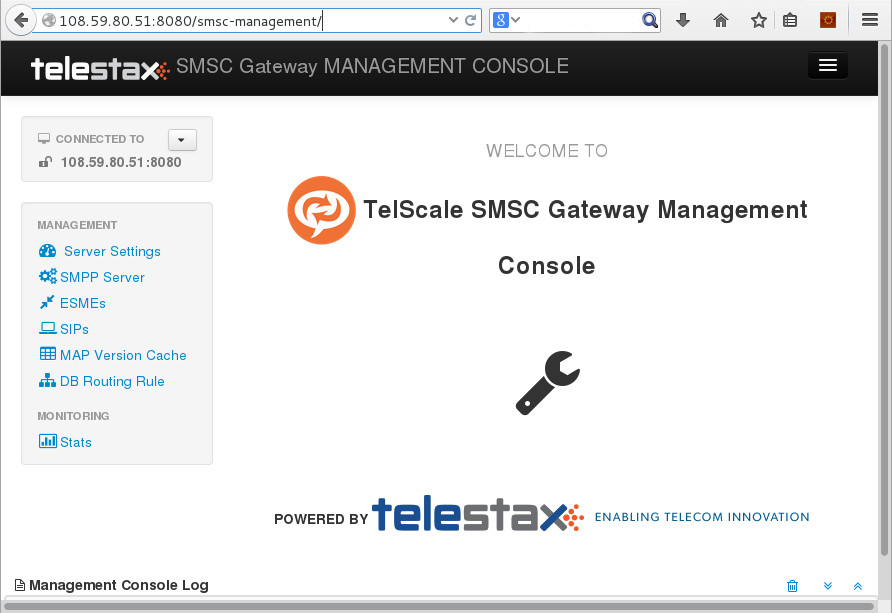
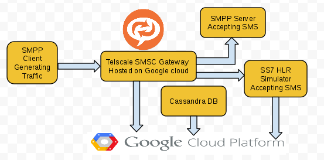
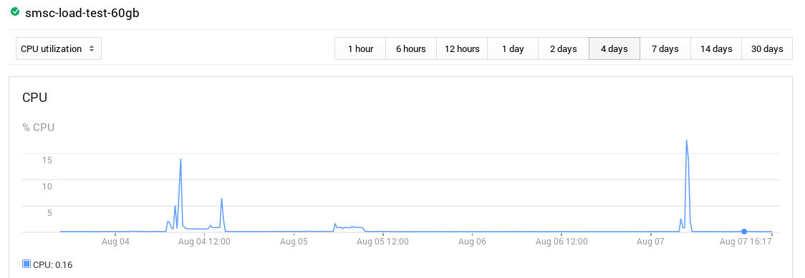
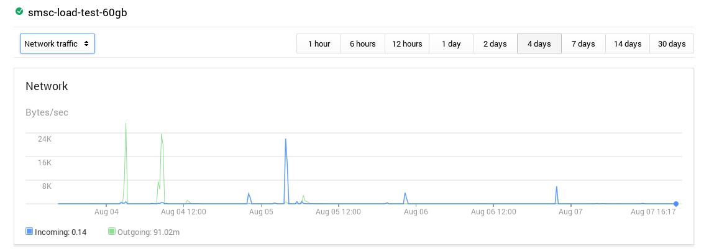
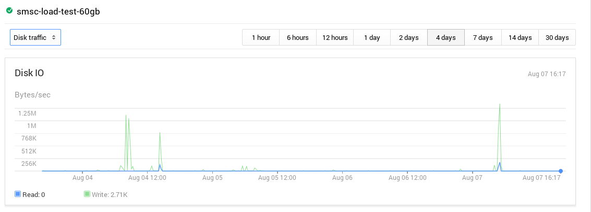

Restcomm SMSC is a robust and carrier proven SMSC built on a modern extensible middleware platform. Restcomm SMSC provides core features for mobile subscriber to send SMS messages (over GSM network via SIGTRAN or legacy E1 links), broadcasting campaigns (via SMPP), and group messaging between subscribers. 

Restcomm SMSC has been deployed on Amazon EC2 https://aws.amazon.com/marketplace/pp/B00H5BUL92/ref=mkt_wir_Restcomm[HERE]. You can also setup Restcomm SMSC on Google Cloud. 

This tutorial will show how to run Restcomm SMSC on Google Cloud 

= Requirements

* Basic Knowledge of Restcomm SMSC
* Latest Cassandra Database
* Google Cloud Compute Engine
* Java JDK 7 or higher
* Httpd
* lksctp for SS7
* On a production setup, it is recommended that you have a machine type that runs Quad Core processor with at least 16GB of memory.

== Step 1

Log into your Google Cloud Developer's Console

* Create a new instance under *Compute ->Compute Engine->New Instance*
* Modify the following fields
* **NAME**: smsc-test
* *Allow Http Traffic* (checked)
* **MACHINE TYPE**: g1-small
* **IMAGE**: Centos-6xxxx
* Leave the rest of the fields as default and press the *Create* button

The newly created instance should now appear on the list of available instances.

* Click on the smsc-test
* At the top of the page, click on the SSH tab to reveal the gcutil command to use for SSH connection
[source,lang:default,decode:true]
----
gcutil --service_version="v1" --project="telestax-smsc-01" ssh --zone="us-central1-a" "smsc-test"
----
* From your local computer, run the above *gcutil* command to open a secure SSH connection to your instance.
* You must have installed and configured gcutil as explained https://developers.google.com/compute/docs/gcutil/[HERE]

= Step 2

This is where you must install all the necessary software on your smsc-test cloud server instance. Cassandra DB

* Download Apache Cassandra DB
[source,lang:default,decode:true]
----
sudo wget http://mirrors.ucr.ac.cr/apache/cassandra/2.0.9/apache-cassandra-2.0.9-bin.tar.gz
----
* extract content
[source,lang:default,decode:true]
----
sudo tar -xf apache-cassandra-2.0.9-bin.tar.gz
----

* Download Restcomm SMSC from https://telestax.zendesk.com/forums/22947518-Product-Downloads[HERE] and extract content of the SMSC zip file

[source,lang:default,decode:true]
----
sudo unzip Restcomm-smsc-6.1.6-Restcomm-SNAPSHOT-1406220037.zip
----

* Download the latest JDK fromhttp://www.oracle.com/technetwork/java/javase/downloads/jdk7-downloads-1880260.html[HERE]
[source,lang:default,decode:true]
----
curl -b oraclelicense=accept-securebackup-cookie -O -L http://download.oracle.com/otn-pub/java/jdk/7u60-b19/jre-7u60-linux-x64.rpm
----

* Install the rpm file
[source,lang:default,decode:true]
----
 sudo yum install jre-7u60-linux-x64.rpm
----

* Install and download Httpd
[source,lang:default,decode:true]
----
sudo yum install httpd
----

= Step 3

You must now start Cassandra and create the Restcomm SMSC DB.

* Go to the Cassandra bin directory */home/charles/apache-cassandra-2.0.9/bin*
* Start cassandra as a background process
[source,lang:default,decode:true]
----
sudo ./cassandra -f &
----
* Create the TelestaxSMC DB using the cassandra.cql file provided with Restcomm SMSC
[source,lang:default,decode:true]
----
sudo /home/charles/apache-cassandra-2.0.9/bin/cqlsh -f  /home/charles/Restcomm-smsc-6.1.6-Restcomm-SNAPSHOT/cassandra/cassandra.cql
----

To make sure the databases are correctly created, run the cqlsh command and check the keyspaces available

[source,lang:default,decode:true]
----
/home/charles/apache-cassandra-2.0.9/bin/cqlsh
----

[source,lang:default,decode:true]
----
 Connected to Test Cluster at localhost:9160.
[cqlsh 4.1.1 | Cassandra 2.0.9 | CQL spec 3.1.1 | Thrift protocol 19.39.0]
Use HELP for help.
cqlsh> describe keyspaces;
RestcommSMSC  system  TelestaxSMSC  system_traces
----

As you can see above, 2 Cassandra keyspaces RestcommSMSC and TelestaxSMSC have been created. Start Restcomm SMSC

* Go to the bin directory of SMSC /home/charles/Restcomm-smsc-6.1.6-Restcomm-SNAPSHOT/jboss-5.1.0.GA/bin
* Make all shell scripts executable
[source,lang:default,decode:true]
----
sudo chmod +x *.sh
----
* Start the SMSC server as a background service and use -b to bind it to the local IP address of your SMSC server instance
[source,lang:default,decode:true]
----
../run.sh -b 10.21.30.41 &
----

If the server is successfully started, you should see a message similar to the following: 

----
JBoss (Microcontainer) [5.1.0.GA (build: SVNTag=JBoss_5_1_0_GA date=200905221634)] Started in 3m:13s:880ms   
----

= Step 4

IMPORTANT: Make sure your firewall settings allows ports 8080. You will need to open more port for further testing. See http://docs.telestax.com/smsc-ami-quick-user-guide/[HERE] for more details

You can access the management interface of SMSC gateway as follows:

* Open your web browser and go to
* *http://PUBLIC_IP_OF_YOUR_GOOGLE_INSTANCE:8080/smsc-management/*

You will see a screenshot similar to the one below 

    

= Sending Traffic to the SMSC Gateway

In this section of the tutorial, we are going to use the SMPP simulator tool that comes prepackaged with Restcomm SMSC to send some packets to the server. This will populate the Restcomm SMSC Casandra DB that was previously created. On a production, environment, the SMS messages are forwarded to destination through an SS7 connection.   Restcomm SMSC comes prepacked with a simulator for basic load testing SMPP. The simulator was configured to send bulk SMPP to the SMSC Gateway server.. You must run the Simulator from a remote computer connecting to the public IP address of the SMSC gateway.

* Cd to the directory *$Restcomm_SMSC_ROOT/tools/Restcomm-smpp-simulator/bin*
* $ *sudo chmod +x run.sh*
* The command above will make the file executable
* Run the following command to start the SMPP Simulator GUI

----
sudo $<strong>$Restcomm_SMSC_ROOT/tools/Restcomm-smpp-simulator/bin</strong>/run.sh
----

= Test Result from Larger Instance

[[test-scenario]]
Test scenario
^^^^^^^^^^^^^

* SMPP Client generating traffic
* SMPP Server accepting SMS from SMSC
* SS7 HLR Simulator and Cassandra were installed and used in the same cloud instance.
* Google compute instance running 16 vCPU, 60 GB memory

[[how-many-sms-processed-per-second]]
How many SMS processed per second
^^^^^^^^^^^^^^^^^^^^^^^^^^^^^^^^^

* Datagram Mode SMPP to SMPP achieved 2500 SMS/Sec
* Datagram Mode SMPP to SS7 achieved 1500 SMS/Sec
 

[[cpu-usage]]
CPU Usage
^^^^^^^^^

During the bulk SMS test, CPU usage was minimal as shown in the screenshot below: 

    

[[network-usage]]
Network Usage
^^^^^^^^^^^^^

[[disk-io-usage]]
Disk I/O Usage
^^^^^^^^^^^^^^

'''''

[[wireshark-trace]]
Wireshark Trace
^^^^^^^^^^^^^^^

If you want to see the trace result of the SMPP traffic, you can access the pcap files https://www.dropbox.com/sh/rk0umxw8wewhxki/AABk7NWnU8tEbGjD638fNl0ma[HERE]    

[[video-tutorial]]
Video Tutorial
~~~~~~~~~~~~~~

If you want to learn more about testing Restcomm SMSC Gateway, please see the video tutorial below  

video::CbEsB6E39ZM[youtube, width=640, height=480]
