This tutorial will show you how to start the Restcomm USSD Gateway and make it act as a CLIENT that will initiate SCTP connection. You will also learn how to configure Restcomm USSD Gateway to connect to 2 operators in a multi-tenancy setup.

[[requirements]]
Requirements
~~~~~~~~~~~~

* It is assumed you are familiar with the basics of SS7 topology and Restcomm USSD Gateway
* You have installed Restcomm USSD Gateway version Restcomm-ussd-6.2.1.257 or higher
* You have installed LKSCTP on your server
* You have Java JDK 1.7x installed

[[network-diagram-for-this-tutorial]]
Network Diagram for this tutorial
^^^^^^^^^^^^^^^^^^^^^^^^^^^^^^^^^

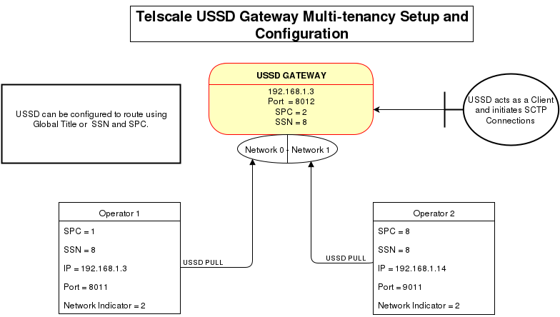

[[step-1---start-restcomm-ussd-and-connect-to-the-ss7-command-line-interface]]
Step 1 - Start Restcomm USSD and Connect to the SS7 Command Line Interface
^^^^^^^^^^^^^^^^^^^^^^^^^^^^^^^^^^^^^^^^^^^^^^^^^^^^^^^^^^^^^^^^^^^^^^^^^^

* Go to *$USSD_HOME/jboss-5.1.0.GA/bin/run.sh -b 192.168.1.3*

Connect to the SS7 command line window

* *$USSD_HOME/jboss-5.1.0.GA/bin/ss7-cli.sh*

This will show an output similar to the one be

* *version=6.2.5.GA-Restcomm,name=Restcomm CLI,prefix=Restcomm,vendor=TeleStax* *Restcomm>*

At the *Restcomm>* prompt, connect to the USSD server on IP 192.168.1.3 and on port 3435

* *Restcomm>connect 192.168.1.3 3435*
* Enter the Username : admin
* Enter the Password : admin

[[step-2---create-a-new-global-title-and-new-network-id]]
Step 2 - Create a New Global Title and New Network ID
^^^^^^^^^^^^^^^^^^^^^^^^^^^^^^^^^^^^^^^^^^^^^^^^^^^^^

Got to ss7 command line terminal as mentioned in Step 1 and create a new Global Title for Network ID 1

* **Restcomm>**ussd set ussdgt 923330053059 1

Check to make sure you now have 2 new GT and Network ID

* Restcomm(192.168.1.3:3435)>**ussd get ussdgt** 
+
ussdgt = networkId=0 - GT=923330053058 
+
networkId=1 - GT=923330053059

You should now see the new Global Title and Network ID 1 you created above and the default Global Title and Networkd ID 0

[[step-3---create-short-code-routing-rules]]
Step 3 - Create Short Code Routing Rules
^^^^^^^^^^^^^^^^^^^^^^^^^^^^^^^^^^^^^^^^

Restcomm(192.168.1.3:3435)>**ussd scrule create *519# http://192.168.1.3:8080/ussddemo/test true HTTP 1** Restcomm(192.168.1.3:3435)>**ussd scrule create *666# http://192.168.1.3:8080/ussddemo/test true HTTP 0** http://192.168.1.3:8080/ussd-management/# 

Under Routing Rules, you should see something similar to the screenshot below 

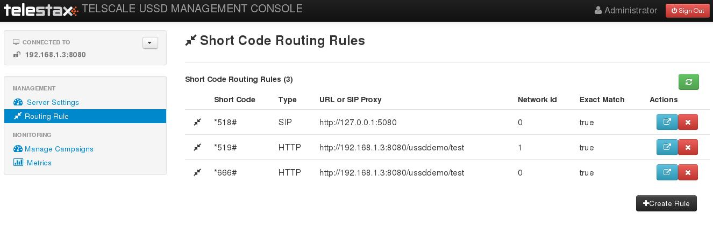

[[step-4---create-sctp-associations-as-clients]]
Step 4 - Create SCTP Associations as CLIENTS
^^^^^^^^^^^^^^^^^^^^^^^^^^^^^^^^^^^^^^^^^^^^

This step will ensure that the USSD will act as a client an initiate SCTP connect to Mobile Operators SCTP association for Operator 1

* Restcomm(192.168.1.3:3435)>**sctp association create ass1 CLIENT 192.168.1.3 8011 192.168.1.3 8012 ​**

SCTP association for Operator 2

* Restcomm(192.168.1.3:3435)>**sctp association create ass2 CLIENT 192.168.1.14 9011 192.168.1.3 9012**

You can check the SCTP associations from the GUI by going to the following IP Address

* http://192.168.1.3:8080/jss7-management-console/#
* Click on : SCTP ->SCTPManagement -> Associations

Screenshot of the 2 Associations created above 

Association 2 

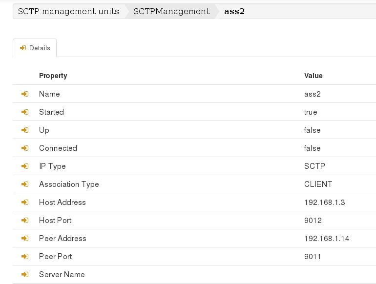

[[step-5---create-m3ua-connection-to-be-linked-to-the-associations-created-in-the-previous-step]]
Step 5 - Create M3UA  connection to be linked to the Associations created in the previous step
^^^^^^^^^^^^^^^^^^^^^^^^^^^^^^^^^^^^^^^^^^^^^^^^^^^^^^^^^^^^^^^^^^^^^^^^^^^^^^^^^^^^^^^^^^^^^^

You have to create Application Server, then, create Application Server Process, Create Application Server with Routing Context 102,Network Appearance 103 and IP Server Process (IPSP)

* Restcomm(192.168.1.3:3435)>**m3ua as create as1 IPSP mode SE rc 102 traffic-mode loadsharing network-appearance 103**

Create Application Server Process and Link it to the SCTP Association created in step 3  above

* Restcomm(192.168.1.3:3435)>**m3ua asp create asp1 ass1**

Link the Application Server Process (ASP) above to the Application Server (AS)

* Restcomm(192.168.1.3:3435)>**m3ua as add as1 asp1**

Start the Application Server Process

* Restcomm(192.168.1.3:3435)>**m3ua asp start asp1**

Create a route for the Application Server  Destination Point Code is 1, Originating Point Code is 2 and the Service Indicator is 3

* Restcomm(192.168.1.3:3435)>**m3ua route add as2 1 2 3**

NOTE: The DPC 1 (Destination Point Code) must match the SPC from Operator 1 (see network diagram above) - The OPC 2 (Originating Point Code) must match the (OPC) of the USSD Gateway (see network diagram above). the Service Indicator 3 tells the system to use SCCP for routing.

[[you-must-create-the-same-steps-for-operator-2]]
You must create the same steps for Operator 2
^^^^^^^^^^^^^^^^^^^^^^^^^^^^^^^^^^^^^^^^^^^^^

1.  Restcomm(192.168.1.3:3435)>**m3ua as create as2 IPSP mode SE rc 102 traffic-mode loadsharing network-appearance 101**
2.  Restcomm(192.168.1.3:3435)>**m3ua asp create asp2 ass2**
3.  Restcomm(192.168.1.3:3435)>**m3ua as add as2 asp2**
4.  Restcomm(192.168.1.3:3435)>**m3ua asp start asp2**
5.  Restcomm(192.168.1.3:3435)>**m3ua route add as1 8 2 3**

In point number 2 the Application Server Process is linked to ass2 (Association 2) which connects using SCTP ports 9011 and 9012 respectively. 

In point number 5 you createed a route for the Application Server  Destination Point Code is 8, Originating Point Code is 2 and the Service Indicator is 3. The DPC 8 matches the SPC from Operator 2 

Here are some screenshots from the USSD JSS7 Management Console GUI

*ASP 1*

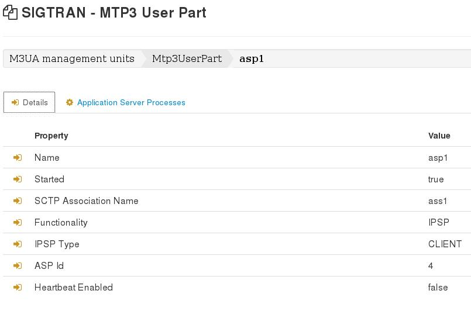

*ASP2*

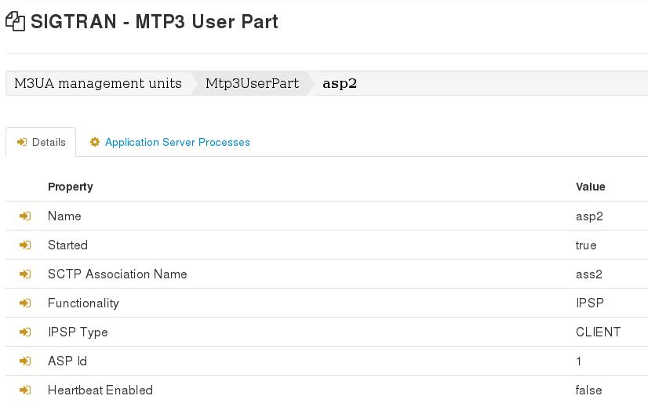

*M3UA ROUTERS*

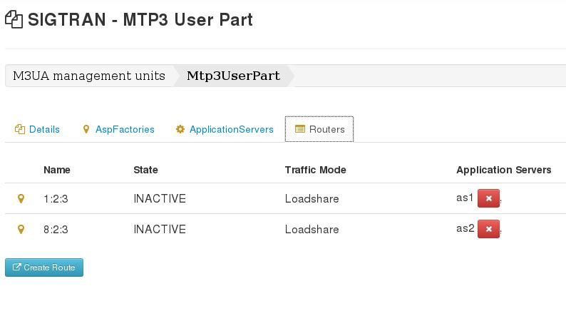

[[step-6---create-sccp-connections-sap-service-access-point]]
Step 6 - Create  SCCP Connections SAP (Service Access Point)
^^^^^^^^^^^^^^^^^^^^^^^^^^^^^^^^^^^^^^^^^^^^^^^^^^^^^^^^^^^^

Create a SAP (Service Access Point) connection for *network id 0*

* Restcomm(192.168.1.3:3435)>**sccp sap create 1 1 2 2 networkid 0**

The above parameters are as follow

* 1 = The unique number that identifiers the SAP
* 1 = The MTP3 id, this identifies the M3UA, there is only one
* 2 = The OPC field must match the USSD Gateway SPC (see network diagram above)
* 2 = Network Indicator is set to *2* for *National* routing and *0* is used for *International* routing
* 0 = default network id as explained in *step 2*

Create a [[ss7-sccp-settings-SccpStack]]MTP3 Destination for the SAP connection

* Restcomm(192.168.1.3:3435)>**sccp dest create 1 1 1 1 0 255 255**

The above parameters are as follow

* 1 = This matches the identifier of the SAP above
* 1 = A unique identifier of this [[ss7-sccp-settings-SccpStack]]MTP3 Destination
* 1 = First Point Code. This must match the SPC of Operator 1 (see network diagram above)
* 1 = Last Point Code
* 0 = First SLS (**Signaling Link Selector (SLS)**— An identifier used for load sharing across linksets and links)
* 255 = Last SLS
* 255 = SLS Mask

Screenshots from the SS7 Management Console GUI

*SAP and MTP Destination*

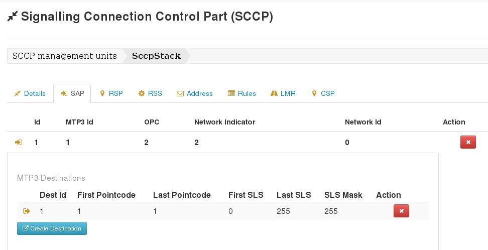

[[step-7---create-sccp-connections-rsp-remote-signalling-point]]
Step 7 - Create  SCCP Connections RSP (Remote Signalling Point)
^^^^^^^^^^^^^^^^^^^^^^^^^^^^^^^^^^^^^^^^^^^^^^^^^^^^^^^^^^^^^^^

* Restcomm(192.168.1.3:3435)>**sccp rsp create 1 1 0 0**

The above parameters are as follow

* 1 = Unique identifier of this RSP
* 1 = Remote SPC that matches the (Operator 1) SPC (see network diagram above)
* 0 = Flag
* 0 = Mask

Screenshots from the SS7 Management Console GUI

*RSP*

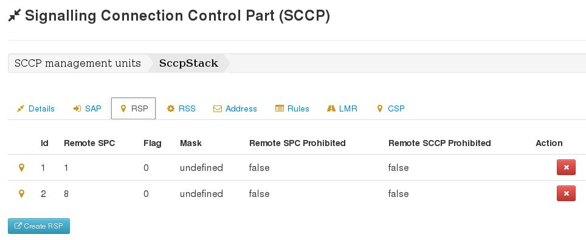

[[step-8---create-sccp-connections-rss-remote-subsystem]]
Step 8 - Create  SCCP Connections RSS (Remote SubSystem)
^^^^^^^^^^^^^^^^^^^^^^^^^^^^^^^^^^^^^^^^^^^^^^^^^^^^^^^^

* Restcomm(192.168.1.3:3435)>**sccp rss create 1 1 8 0**

The above parameters are as follow

* 1 = Unique identifier of this RSS
* 1 = Remote SPC that matches the (Operator 1) SPC (see network diagram above)
* 8 = Remote SSN that matches the (Operator 1) SSN (see network diagram above)
* 0 = Flag

Screenshots from the SS7 Management Console GUI

*RSS*

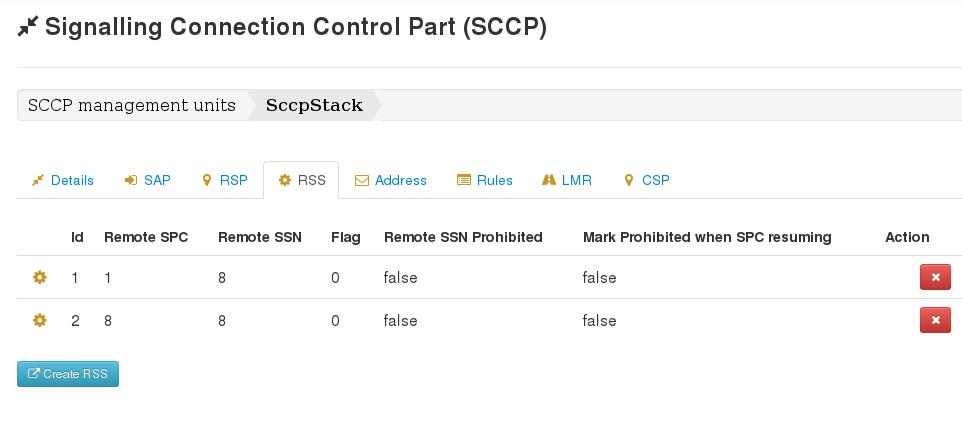

[[step-9---create-sccp-address]]
Step 9 - Create  SCCP Address
^^^^^^^^^^^^^^^^^^^^^^^^^^^^^

* 1 = Unique identifier
* 82 = Address indicator 82 means that the Global Title includes ( [[ss7-sccp-settings-SccpStack]]Translation Type, Numbering Plan and Encoding Scheme and Nature of Address) but routing will be based on PC and SSN
* 1 = Point Code that must match (Operator 1) SPC (see network diagram above)
* 8 = SubSystem Number that must match (Operator 1) SSN (see network diagram above)
* 1 = Translation Type
* 1 = Numbering Plan
* 4 = Nature of Address - 4 represents International Carrier while 3 represents National Carrier
* * = Global Title Digits. * represents wildcard.

Screenshots from the SS7 Management Console GUI

*ADDRESS*

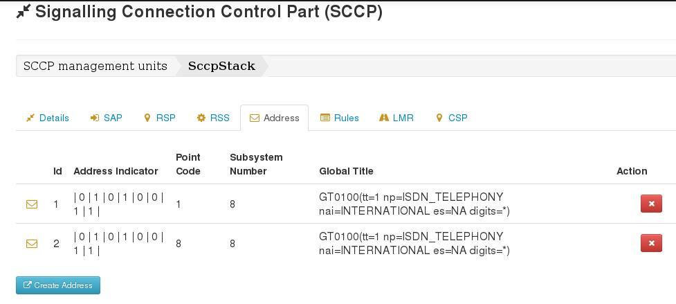

[[step-10---create-sccp-rules]]
Step 10 - Create  SCCP Rules
^^^^^^^^^^^^^^^^^^^^^^^^^^^^

Restcomm(192.168.1.3:3435)**>sccp rule create 2 K 82 1 8 1 1 4 * solitary 2 origination-type remoteOriginated networkid 0**

* 1 =  Unique identifier for the SCCP rule
* K = <mask> Retain the original dialed digits of this section in the translated digits.
* 82 = <address-indicator>(see Step 8 for more information)
* 1 = <point-code>
* 8 = <subsystem-number>
* 1 =  <translation-type>
* 1 = <numbering-plan>
* 4 = <nature-of-address-indicator>
* * = <digits>
* solitary = <ruleType>
* 1 = <primary-address-id> This matches the unique identifier of the address created in Step 8
* origination-type remoteOriginated = This identifies means that the Operator 1 can send a USSD PULL
* networkid 0 = This rule will add the network ID 0 to the any incoming message that matches the specified PC ans SSN

Screenshots from the SS7 Management Console GUI

*SCCP RULE*

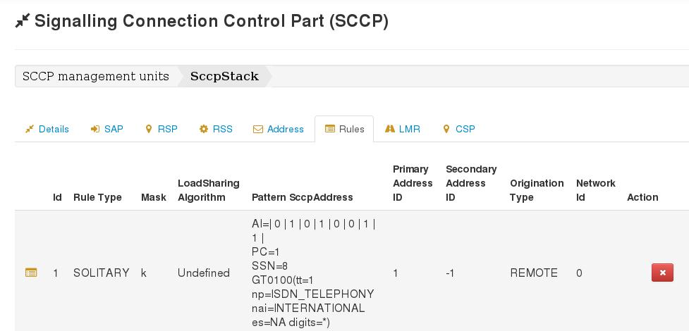

[[step-11---create-the-same-sccp-configuration-for-operator-2]]
Step 11 - Create the same SCCP Configuration for Operator 2
^^^^^^^^^^^^^^^^^^^^^^^^^^^^^^^^^^^^^^^^^^^^^^^^^^^^^^^^^^^

Note that the networkid is set to 1. The SPC is 8 and the SSN is 8 (see network diagram at the top of the page)

----
Restcomm(192.168.1.3:3435)>sccp sap create 2 1 2 2 networkid 1
Restcomm(192.168.1.3:3435)>sccp dest create 2 1 8  8 0 255 255 
Restcomm(192.168.1.3:3435)>sccp rsp create 2 8 0 0
Restcomm(192.168.1.3:3435)>sccp rss create 2 8 8 0
Restcomm(192.168.1.3:3435)>sccp address create 2 82 8 8 1 1 4 *
Restcomm(192.168.1.3:3435)>sccp rule create 2 K 82 8 8 1 1 4 * solitary 2 origination-type remoteOriginated networkid 1
----

[[step-12---simulate-the-operators-connection-by-starting-the-jss7-simulator-as-a-server]]
Step 12 - Simulate the Operator's Connection by starting the JSS7 Simulator as a Server
^^^^^^^^^^^^^^^^^^^^^^^^^^^^^^^^^^^^^^^^^^^^^^^^^^^^^^^^^^^^^^^^^^^^^^^^^^^^^^^^^^^^^^^

Go to $USSD_HOME/tools/Restcomm-jss7-simulator/bin Change the permission of the all .sh file to execute

* *chmod +x *.sh*

Start the simulator

* *./run.sh gui*

Press the *Start* button

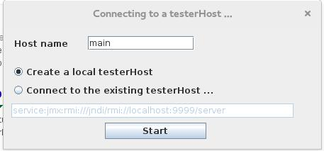

Press the edit button to configure M3UA as shown below 

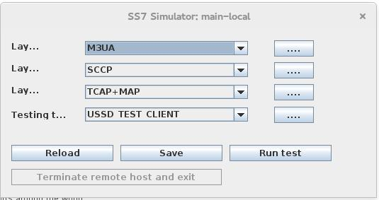

Configure the M3UA settings as below to simulate Operator 1 network as shown below 

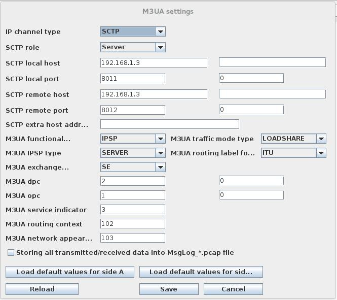

Configure the SCCP settings as below to simulate Operator 1 network as shown below. Not that Routing is based on DPC and SSN

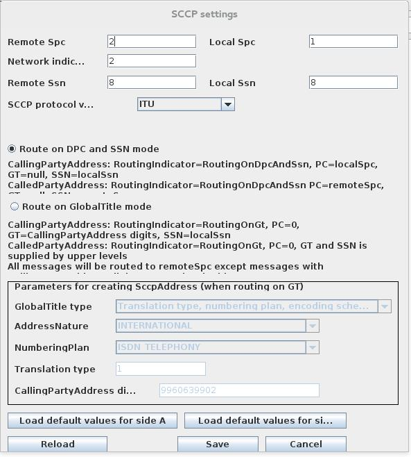

* Save the configuration and go back to the main window
* Press the button Run Test
* You will see a screenshot similar to the one below

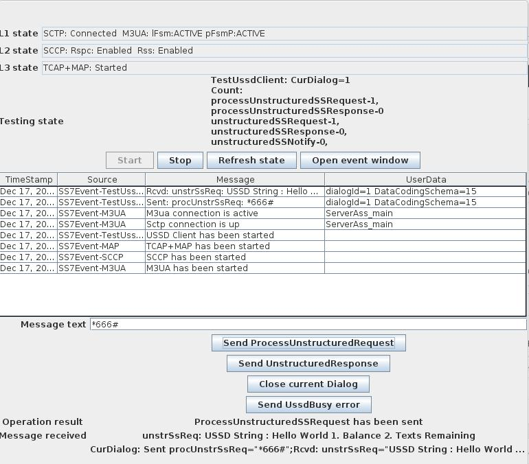

* In the "Message text" box type the short code *666# and press the button "Send ProcessUnstructuredRequest"
* You will see the Message in the message above that prompts you to choose either 1 for "Hello World" or 2 for "Remaining Balance"
* Delete the text in the "Message text" box and enter your choice (1 or 2), then, press the button "Send UnstructureResponse".
* You will receive a final reply from the USSD Server

[[step-13---simulate-the-operator-2-from-the-ip-192.168.1.14]]
Step 13 - Simulate the Operator 2 from the IP 192.168.1.14
^^^^^^^^^^^^^^^^^^^^^^^^^^^^^^^^^^^^^^^^^^^^^^^^^^^^^^^^^^

Start the JSS7 from another computer. Go to $USSD_HOME/tools/Restcomm-jss7-simulator/bin Change the permission of the all .sh file to execute

* *chmod +x *.sh*

Start the simulator

* *./run.sh gui*

Press the *Start* button and follow the same procedure as in Step 12. The SCTP M3UA configuration should use the following IP address:

* SCTP Local Host IP = 192.168.1.14
* SCTP Local Host Port = 9011
* SCTP Remote Host IP = 192.168.1.3
* SCTP Remotet Port = 9012
* M3UA DPC = 2
* M3UA OPC = 8
* M3UA Service Indicator  = 3

The SCCP Setting should use

* Local SPC = 8
* Local SSN = 8
* Remote SPC = 2
* Remote SSN = 8
