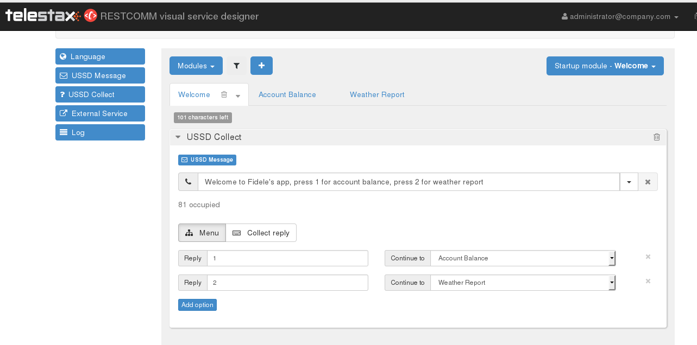
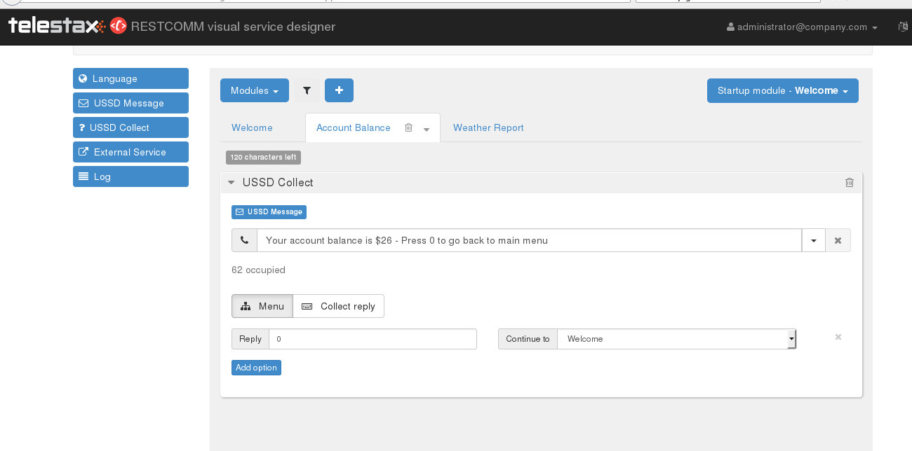
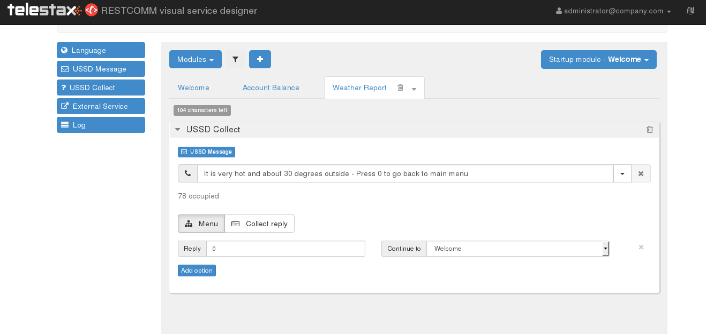

This quick tutorial will show how to solve the following USSD application scenario. 

A user can go back to the root menu after receiving the result of his chosen menu.  For example, the Main menu says

* Press 1 for account balance and press 2 for weather report.
* User chooses 1 and gets account balance. Can the user go back to the main menu and choose another option?

Here is a quick USSD Restcomm app built with the RVD that will explain how to go back to the main menu.  

[[step-1---create-a-welcome-main-module-in-the-rvd]]
Step 1 - Create a Welcome Main Module in the RVD
~~~~~~~~~~~~~~~~~~~~~~~~~~~~~~~~~~~~~~~~~~~~~~~~

[[step-2---create-a-module-to-hold-the-first-menu-option]]
Step 2 -  Create a Module to hold the first Menu Option
~~~~~~~~~~~~~~~~~~~~~~~~~~~~~~~~~~~~~~~~~~~~~~~~~~~~~~~

Note that the module Account Balance uses the USSD Collect verb to send a reply and also allow user to return to the main menu 

[[step-3---create-a-module-to-hold-the-second-menu-option]]
Step 3 - Create a Module to hold the second Menu Option 
~~~~~~~~~~~~~~~~~~~~~~~~~~~~~~~~~~~~~~~~~~~~~~~~~~~~~~~

Note that the module Account Balance uses the USSD Collect verb to send a reply and also allow user to return to the main menu

You can save the application and assign a USSD number in the Restcomm main Dashboard GUI. The assigned SIP number must be in the format (ex. *1234#)          
