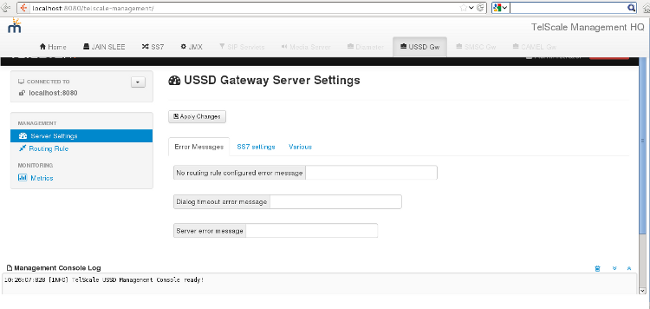
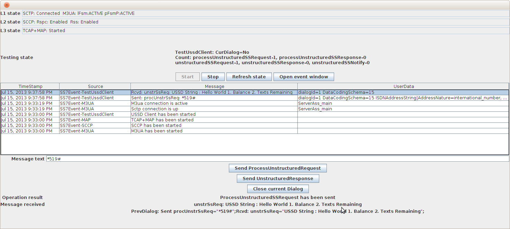
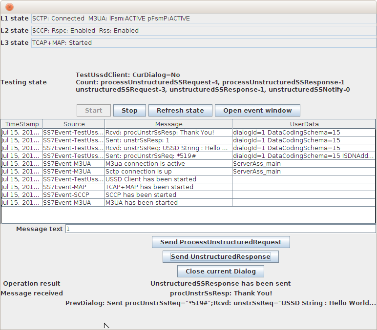

[[pre-requisite]]
= Pre-requisite:

* You must have Restcomm USSD Gateway installed as explained in the Installation Guide.
* If you are using the SS7 board on server, you must ensure that the `java.library.path` variable is set to point to the directory containing the native component. Alternatively you can copy it to the JBoss native library path manually.

[[step-1---start-the-ussd-server]]
= Step 1 - Start the USSD Server

* Go to **$USSD_GATEWAY_HOME`/jboss-5.1.0.GA/bin`**.
* ./run.sh -b LOCAL_SERVER_IP -c simulator
* This will start the USSD Gateway in simulator mode
*  If the service is correctly started, you should see an output similar to the one below
+
[source,screen]
----
22:23:12,498 INFO  [Http11Protocol] (main) Starting Coyote HTTP/1.1 on http-127.0.0.1-8080
22:23:12,529 INFO  [AjpProtocol] (main) Starting Coyote AJP/1.3 on ajp-127.0.0.1-8009
22:23:12,541 INFO  [ServerImpl] (main) JBoss (Microcontainer) [5.1.0.GA (build: SVNTag=JBoss_5_1_0_GA date=200905221634)] Started in 1m:11s:118ms
----

[[step-2---accessing-the-ussd-admin-ui-interface]]
= Step 2 - Accessing the USSD Admin UI Interface

* Go to http://localhost:8080/ussd-management/.

*GUI - Restcomm USSD Gateway:*

[[step-3---start-the-jss7-simulator-and-send-traffic-to-the-ussd-gateway]]
= Step 3 - Start the jSS7 Simulator and send traffic to the USSD Gateway

* Go to the directory *$USSD_GATEWAY_HOME`/jboss-5.1.0.GA/tools/`*
* Add executable mode to the ./run.sh
* start the jss7 simulator
* *chmod +x run.sh*
* Start the jSS7 Simulator
* * `./run.sh gui`*
* In the GUI select "main" (default) as host name [or type "win" as host name under Windows] and press the 'Start' button.
* Press 'Run test' and again click on 'Start' in the next screen.
*  To test under Windows OS, you must change the SS7 simulator settings to TCP.

After a few seconds you will see the state of the Simulator change to "M3UA connection is active" as shown below:

*USSD SS7 Simulator - Active:*

image:./images/USSD_SS7_Simulator_ACTIVE.png[USSD SS7 Simulator - Active,width=545,height=477]

* Restcomm USSD Gateway is configured with a (demo) routing rule for ***519#**.
* In the textfield dial ***519#**  and press '**Send ProcessUnstructuredRequest**'.
* The example will respond with the message "**Hello World 1. Balance 2. Texts Remaining**".

*USSD SS7 Simulator - Process Unstructured Request:*

* Reply to the USSD message
* Dial 1 in your Simulator GUI and press '**Send UnstructuredResponse**'.
* You should get a response "Thank you!".

*USSD SS7 Simulator - Unstructured Request:*

