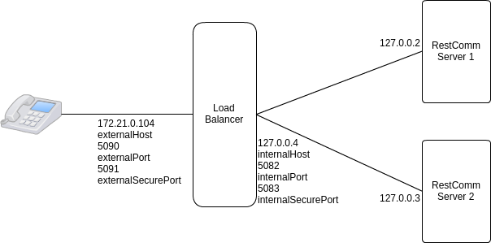

= Configure Load-balancer and two Restcomm servers on the same local machine

.Load balancer and Restcomm servers diagram

This tutorial will show you how to configure two Restcomm instances and Load Balancer instance on one machine with OS Ubuntu.

.Step 0: Create three sub interfaces
Example for Ubuntu:

Restcomm-server1

root@ubuntu:~# ifconfig lo:1 127.0.0.2 netmask 255.255.255.0

Restcomm-server2

root@ubuntu:~# ifconfig lo:2 127.0.0.3 netmask 255.255.255.0

Load balancer

root@ubuntu:~# ifconfig lo:3 127.0.0.4 netmask 255.255.255.0

.Step 1: Install Mysql

Example for Ubuntu: https://www.linode.com/docs/databases/mysql/install-mysql-on-ubuntu-14-04

.Step 2: Download the latest version of Restcomm

. Download the latest version of Restcomm zip file from:
https://mobicents.ci.cloudbees.com/job/RestComm/lastSuccessfulBuild/artifact/

. Unzip the binary to a local directory. It should be similar to this Mobicents-Restcomm-JBoss-AS7-<version-number>.
We shall refer to this above Restcomm directory as the $RESTCOMM_HOME.

.Step 3: Configuring the mybatis.xml file to use Mysql

. Edit the file $RESTCOMM_HOME/standalone/deployments/restcomm.war/WEB-INF/conf/mybatis.xml
. Change the <environments default="production"> to  <environments default="mariadb">
. Add the MariaDB configuration environment tag as shown below

    <environment id="mariadb">
      <transactionManager type="JDBC"/>
      <dataSource type="POOLED">
        <property name="driver" value="com.mysql.jdbc.Driver"/>
        <property name="url" value="jdbc:mysql://127.0.0.1:3306/restcomm"/>
        <property name="username" value="SQL_Login"/>
        <property name="password" value="SQL_Password"/>
      </dataSource>
    </environment>

. Save and exit the mybatis.xml file

.Step 4: Start Mysql and Create the restcomm Database

. Start mysql service if it is not already started  – sudo /etc/init.d/mysql start
. Go to the directory $RESTCOMM_HOME/standalone/deployments/restcomm.war/WEB-INF/scripts/mariadb
. There will be an init.sql file and an sql directory
. Create the restcomm database from the init.sql as follows:

  mysql -u root -p < init.sql

. Log into mysql and make sure the restcomm database is created :  show databases

.Step 5: Edit the restcomm.xml file to point the DAO to mysql

. Edit the file $RESTCOMM_HOME/standalone/deployments/restcomm.war/WEB-INF/conf/restcomm.xml
. Find the dao-manager tag and change the sql-files path to mariadb as shown below

  <dao-manager class="org.mobicents.servlet.restcomm.dao.mybatis.MybatisDaoManager">
    <configuration-file>${restcomm:home}/WEB-INF/conf/mybatis.xml</configuration-file>
    <data-files></data-files>
    <sql-files>${restcomm:home}/WEB-INF/scripts/mariadb/sql</sql-files>
  </dao-manager>

.Step 6: Download Mysql Java Client Driver
. Download the latest mysql java connector client driver jar file from http://mvnrepository.com/artifact/mysql/mysql-connector-java.
. Put jar file in $RESTCOMM_HOME/standalone/deployments/restcomm.war/WEB-INF/lib/

.Step 7: Download key store file for SSL

You can download file from
https://github.com/RestComm/load-balancer/blob/master/config-examples/keystore
(password 123456) or create independently and put this file
in package $RESTCOMM_HOME/standalone/configuration/

.Step 8: Edit mss-sip-stack.properties file

. Edit the file $RESTCOMM_HOME/standalone/configuration/mss-sip-stack.properties
. Add next lines to file

  org.mobicents.ha.javax.sip.BALANCERS=127.0.0.4:5082
  org.mobicents.ha.javax.sip.LOCAL_HTTP_PORT=8080
  org.mobicents.ha.javax.sip.LOCAL_SSL_PORT=8443
  org.mobicents.ha.javax.sip.REACHABLE_CHECK=false
  gov.nist.javax.sip.TLS_CLIENT_AUTH_TYPE=Disabled
  javax.net.ssl.keyStore=/absolutePathToKeystore/keystore
  javax.net.ssl.keyStorePassword=123456
  javax.net.ssl.trustStorePassword=123456
  javax.net.ssl.trustStore=/absolutePathToKeystore/keystore
  javax.net.ssl.keyStoreType=JKS

.Step 9: Configure Restcomm IP information and Text-to-speech

. Go to the directory $RESTCOMM_HOME/bin/restcomm
. Open the file restcomm.conf
. Go to the section # Network configuration

. Configure the following variables with the network configuration details of your first server.

  #Network configuration
  NET_INTERFACE='lo:1'
  PRIVATE_IP='127.0.0.2'
  SUBNET_MASK='255.255.255.0'
  NETWORK='127.0.0.0'
  BROADCAST_ADDRESS='127.0.0.255'

. Add next parameters for enabling https connector (password and alias for file from github example)

  #HTTPS Settings
  #File should be located at $RESTCOMM_HOME/standalone/configuration folder.
  #Provide just the name of the trustore file. Leave it blank to disable HTTPS
  TRUSTSTORE_FILE='keystore'
  #Password for the trustore file
  TRUSTSTORE_PASSWORD='123456'
  #The certificate alias
  TRUSTSTORE_ALIAS='smpp'
  #Control whether or not Restcomm will accept self-signed certificates.
  #Values allowall=allow #self-signed certificates,
  #strict=don't allow self signed certificates
  SSL_MODE='allowall'

. Add your VoiceRSS API key to the variable

  VOICERSS_KEY=‘f4840af6675b4d20a8d96dea8466296b‘

. Also edit next lines

  ACTIVATE_LB='TRUE'
  LB_ADDRESS='127.0.0.4'
  LB_INTERNAL_PORT='5082'
  LB_SIP_PORT_UDP='5080'
  LB_SIP_PORT_TCP='5080'
  LB_SIP_PORT_TLS='5081'
  LB_SIP_PORT_WS='5082'
  LB_SIP_PORT_WSS='5083'

. Save and exit the restcomm.conf file

.Step 10: Configure proxy.conf file

Change in $RESTCOMM_HOME/bin/restcomm/proxy.conf file next lines

  ACTIVE_PROXY='true'
  PROXY_IP='172.21.0.104'
  PROXY_PRIVATE_IP='127.0.0.4'

.Step 11: Configuration second Restcomm server

. Copy $RESTCOMM_HOME folder to separate folder and change next files there:
.. $RESTCOMM_HOME/bin/restcomm/restcomm.conf

  NET_INTERFACE='lo:2'
  PRIVATE_IP='127.0.0.3'

.. $RESTCOMM_HOME/bin/restcomm/start-restcomm.sh

Because we are going to start second Restcomm server on same machine,
we should change name of screen session "restcomm" to "restcomm2"
or something like that and name of screen session "mms" to "mms2".
Also we should add property -bmanagement=$bind_address, as shown below:

  if screen -list | grep -q 'restcomm2'; then
  echo 'TelScale RestComm is already running on screen session "restcomm2"!'
  ....
  echo 'TelScale RestComm started running on standalone mode. Screen session: restcomm2.'
  ....
  $RESTCOMM_HOME/bin/standalone.sh -b $bind_address -bmanagement=$bind_address
  else
  screen -dmS 'restcomm2' $RESTCOMM_HOME/bin/standalone.sh -b $bind_address -bmanagement=$bind_address
  ....
  screen -dmS 'restcomm2' $RESTCOMM_HOME/bin/domain.sh -b $bind_address -bmanagement=$bind_address
  echo 'TelScale RestComm started running on domain mode. Screen session: restcomm2.'
  ....
  screen -dmS 'restcomm2' $RESTCOMM_HOME/bin/standalone.sh -b $bind_address -bmanagement=$bind_address
  echo 'TelScale RestComm started running on standalone mode. Screen session: restcomm2.'
  ....
  if screen -ls | grep -q 'mms2'; then
  echo '...Mobicents Media Server is already running on screen session "mms2"!'
  else
  chmod +x $MMS_HOME/bin/run.sh
  screen -dmS 'mms2'  $MMS_HOME/bin/run.sh
  echo '...Mobicents Media Server started running on screen "mms2"!'

.. $RESTCOMM_HOME/bin/restcomm/stop-restcomm.sh

  if screen -ls | grep -q 'mms2'; then
  screen -S 'mms2' -p 0 -X 'quit'
  echo '...stopped Mobicents Media Server instance running on screen session "mms2"...'
  ....
  if screen -list | grep -q 'restcomm2'; then
  screen -S 'restcomm2' -p 0 -X 'quit'
  echo '...stopped RestComm instance running on screen session "restcomm2"!'

.Step 12: Start Restcomm servers and Open the Admin GUI

. Go to the directory Restcomm by running the $RESTCOMM_HOME/bin/restcomm/
. Run the command below to start Restcomm and the media server:

  ./start-restcomm.sh

. Open your web browser and go to the url – http://127.0.0.2:8080/
. Log in with the username=administrator@company.com and the password=RestComm
You will be prompted to change the default password.
. For stopping Restcomm run the command:

  ./stop-restcomm.sh

.Step 13: Download and configuring of Load Balancer

. Download last version of load balancer jar file from https://mobicents.ci.cloudbees.com/job/Restcomm-LoadBalancer/lastSuccessfulBuild/artifact/jar/target/sip-balancer-jar-x.x.xx-jar-with-dependencies.jar.
Where <x.x.xx> is the release version number
. Download configuration file for load balancer from https://mobicents.ci.cloudbees.com/job/Restcomm-LoadBalancer/ws/lb-configuration.properties
. Download log4g file for load balancer from https://mobicents.ci.cloudbees.com/job/Restcomm-LoadBalancer/ws/lb-log4j.xml
. Put this files in one folder
. Modify lb-configuration.properties file for correct work. Comment #host= line, and uncomment end set up next lines:

  externalHost=172.21.0.104
  externalPort=5090
  internalHost=127.0.0.4
  internalPort=5082

. If you need the transport UDP,TCP,TLS the property isTransportWs must be "false", if UDP, WS, WSS this propery must be "true" and set up next lines:

  externalSecurePort=5091
  internalSecurePort=5083

.Step 14: Use Olympus with Restcomm for WS and WSS

For adding certificate of Load balancer to your browser you should connect to it:

https://127.21.0.104:5091

and confirm certificate.

For WS:

Login to Restcomm server http://127.0.0.2:8080/olympus/
Fill in form: Load Balancer's ip adress (externalHost) 172.21.0.104 and port(externalPort) 5090

For WSS:

Login to Restcomm server https://127.0.0.2:8443/olympus/
Fill in form: Load Balancer's ip adress (externalHost) 172.21.0.104 and port (externalSecurePort) 5091
